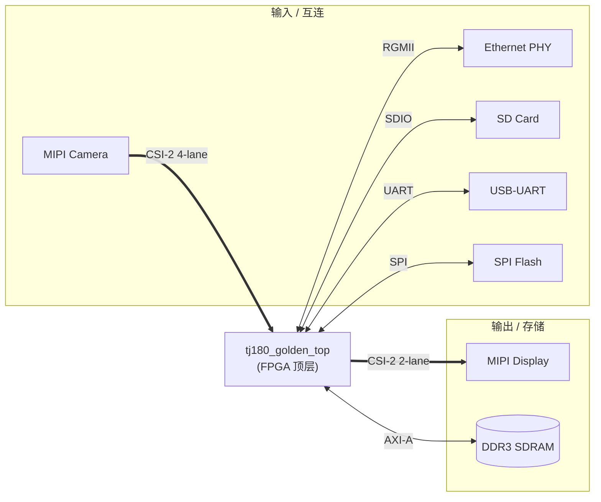
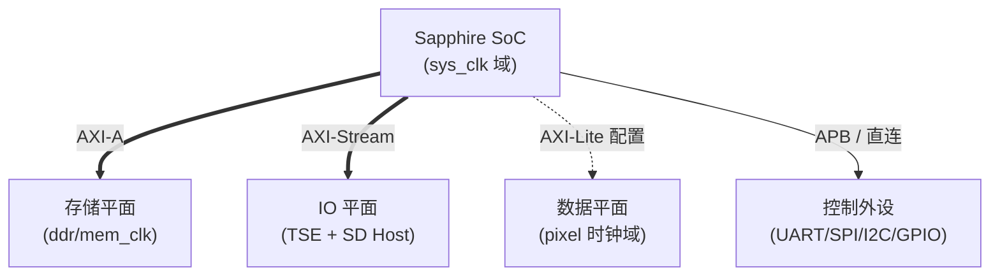
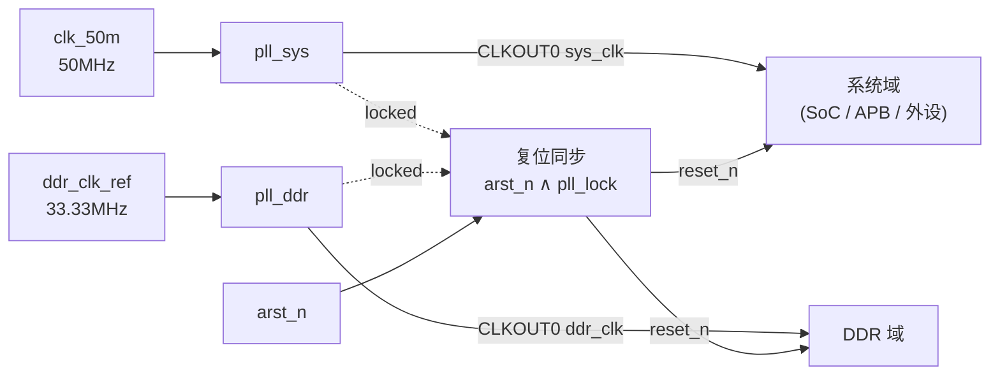
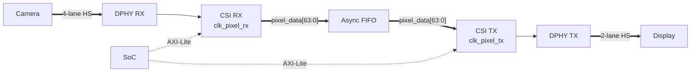
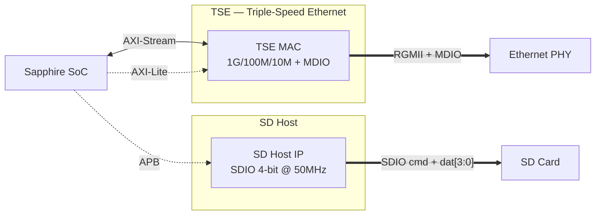
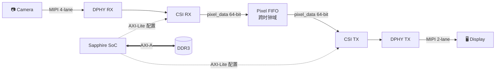

# TJ180 Golden Top — 工程拓扑与接口定义文档

| 项目 | 内容 |
|------|------|
| **工程名称** | `tj180_golden_top` |
| **核心板** | `tj180-core`（TJ180A484S，Efinix Titanium） |
| **底板** | `awesom-base` |
| **夹克（Jacket）** | 无 |
| **顶层模块** | `tj180_golden_top`（`tj180_golden_top.v`） |
| **Efinity 版本** | 2026.1 |
| **文档版本** | v0.2 |
| **最后更新** | 2026-07-18 |
| **状态** | Stage 4（SoC + DDR + MIPI CSI-2 RX/TX Loopback + RGMII Ethernet MAC + SD Host 总线槽位 已集成） |

---

## 1. 概述

本工程是 TJ180A484S 核心板的 Golden Top 集成工程，目标是把以下 IP 子系统统一集成到一个顶层设计中：

- **Sapphire RISC-V SoC**（`ip/sapphire_soc/`）— 主控处理器
- **MIPI CSI-2 RX**（`ip/hard_csi_rx/`）— 4-lane 摄像头输入
- **MIPI CSI-2 TX**（`ip/hard_csi_tx/`）— 2-lane 视频输出
- **DDR3 控制器**（外部 IP）— 通过 AXI0/AXI1 双端口接 SoC
- **RGMII Ethernet MAC**（外部 IP）
- **SD Host**（参考 `ip/tj180a484s_sdhost/TJ180A484S.v`）

本文档描述目标系统拓扑、模块间接口定义、以及当前工程的集成进度。

> **⚠️ 关键现状：** 当前 `tj180_golden_top.v` 是 Efinity 2026.1 自动生成的 Stage 0 占位顶层，**所有 IP 尚未例化**，模块体内仅有 `assign` 默认值。本文档第 4 章描述的拓扑是「端口所揭示的目标架构」，是后续集成的依据。

---

## 2. 工程目录结构

```
tj180_golden_top/
├── tj180_golden_top.v          # 顶层（Stage 0 占位 stub）
├── tj180_golden_top.xml        # Efinity 工程文件
├── awesom-project.md           # AweSOM 工程清单
├── constraints/
│   ├── base.sdc                # 基础时序约束
│   ├── base.peri.isf           # 基础外设引脚
│   ├── tj180_golden_top.sdc    # 工程时序约束
│   └── tj180_golden_top.peri.isf
├── rtl/
│   ├── top.sv                  # 板卡模板 Stage 0（LED 慢闪，未参与顶层）
│   └── pll_top.sv              # PLL 占位包装（穿透 clk50_in，未参与顶层）
├── ip/
│   ├── sapphire_soc/           # RISC-V SoC（IP v3.2.3）
│   ├── hard_csi_rx/            # MIPI CSI-2 RX（IP v5.5.1，4-lane）
│   ├── hard_csi_tx/            # MIPI CSI-2 TX（IP v5.14，2-lane）
│   ├── tj180a484s_sdhost/      # 参考集成（SoC + SD Host + DDR）
│   └── i2c_master/             # 空占位
├── debug/                      # 调试相关
├── sim/                        # 仿真
└── source/
```

---

## 3. 现状审计

| 项目 | 状态 | 说明 |
|------|------|------|
| 顶层端口声明 | ✅ 完整 | 覆盖所有外设 IO（UART/SPI/I2C/GPIO/SD/MIPI/RGMII/DDR/JTAG） |
| PLL 复位控制 | ✅ 已实现 | `sys_pll_rstn = ddr_pll_rstn = phy_rstn = arst_n` |
| LED 指示 | ✅ 已实现 | LED[0] 慢闪，LED[1]=sys_pll_lock，LED[2]=ddr_pll_lock，LED[3]=常亮 |
| I2C 开漏转换 | ✅ 已实现 | `writeEnable = ~write` |
| MIPI TX 输出 | ⚠️ 拉零 | TX 处于复位（`RESET=1`） |
| MIPI RX 控制 | ⚠️ 保持复位 | `RESET=1, RST0_N=1` |
| RGMII TX | ⚠️ 拉零 | 未驱动 |
| GPIO 输出 | ⚠️ 拉零 | 未驱动 |
| **Sapphire SoC 例化** | ❌ 未集成 | — |
| **CSI RX/TX 例化 + Pixel Loopback** | ❌ 未集成 | — |
| **DDR 控制器例化 + AXI 位宽桥** | ❌ 未集成 | — |
| **Ethernet MAC 例化** | ❌ 未集成 | — |
| **SD Host 例化** | ❌ 未集成 | — |

---

## 4. 系统拓扑

### 4.1 顶层系统框图

只展示 FPGA 与外部设备的主接口关系，内部子系统详见 §4.1.1 ~ §4.1.4。



### 4.1.1 FPGA 内部平面划分

FPGA 内部按四个时钟域/功能平面组织。



### 4.1.2 时钟与复位子系统



### 4.1.3 视频数据通路（CSI RX → FIFO → CSI TX）



### 4.1.4 IO 子系统（TSE + SD Host）



### 4.2 数据流主路径



---

## 5. 接口定义（信号级）

### 5.1 时钟与复位域

| 源 | 信号 | 去向 | 说明 |
|----|------|------|------|
| 外部晶振 | `clk_50m` (50MHz) | `pll_sys` 输入 | 系统主参考时钟 |
| 外部晶振 | `ddr_clk_ref` (33.33MHz) | `pll_ddr` 输入 | DDR 参考时钟 |
| `pll_sys` | `pll_sys_CLKOUT0` → `sys_clk` | SoC / APB / 外设 | 系统主时钟 |
| `pll_ddr` | `pll_ddr_CLKOUT0` → `ddr_clk` | DDR 控制器 | DDR 时钟 |
| DDR IP | `i_axi0_mem_clk` / `i_axi1_mem_clk` | AXI 总线时钟域 | 内存时钟 |
| 复位逻辑 | `reset_n` | 全局 | `reset_n = arst_n & sys_pll_lock & ddr_pll_lock`，异步低有效 |
| PLL Lock 反馈 | `sys_pll_lock`, `ddr_pll_lock` | 复位逻辑 / LED | 高有效锁定指示 |

**复位策略**（遵循 AweSOM RTL Rules §4 异步复位同步释放）：

```verilog
assign reset_n = arst_n & sys_pll_lock & ddr_pll_lock;
assign sys_pll_rstn = arst_n;
assign ddr_pll_rstn = arst_n;
assign phy_rstn     = arst_n;
```

### 5.2 Sapphire SoC ↔ DDR（AXI-A Master → AXI0/AXI1）

SoC 输出 32-bit AXI，需经 **位宽转换桥** 后接 DDR 的 512-bit 双端口。

| SoC AXI-A Master (32-bit) | DDR AXI0 (512-bit) | 方向 |
|---------------------------|--------------------|------|
| `axiA_AWVALID / AWADDR[31:0] / AWID[7:0] / AWLEN[7:0]` | `axi0_AWVALID / AWADDR[32:0] / AWID[5:0] / AWLEN[7:0]` | SoC → DDR |
| `axiA_WVALID / WDATA[31:0] / WSTRB[3:0] / WLAST` | `axi0_WVALID / WDATA[511:0] / WSTRB[63:0] / WLAST` | SoC → DDR |
| `axiA_BREADY` | `axi0_BVALID / BID[5:0] / BRESP[1:0]` | DDR → SoC |
| `axiA_ARVALID / ARADDR / ARID / ARLEN` | `axi0_ARVALID / ...` | SoC → DDR |
| `axiA_RREADY` | `axi0_RVALID / RDATA[511:0] / RID / RLAST / RRESP` | DDR → SoC |

> **⚠️ 关键设计点：** SoC 32-bit ↔ DDR 512-bit 位宽不匹配，必须插入 `axi_dwidth_converter`（或自定义桥），否则综合报连接错误。AXI1 端口当前在顶层未声明控制信号（仅 RDATA/RVALID 等），推测用作 DDR 第二主端口或预留。

### 5.3 SoC ↔ MIPI CSI（AXI-Lite 寄存器配置）

CSI RX/TX 各自带一个 AXI4-Lite slave（6-bit 地址 + 32-bit 数据）：

| SoC 端 | CSI RX/TX 端 | 方向 |
|--------|--------------|------|
| `apb_to_axilite` 转出 `axi_awvalid / awaddr[5:0] / awvalid` | `axi_awvalid / axi_awaddr[5:0]` | SoC → CSI |
| `axi_wvalid / wdata[31:0]` | `axi_wvalid / axi_wdata[31:0]` | SoC → CSI |
| `axi_bready` | `axi_bvalid` | CSI → SoC |
| `axi_arvalid / araddr[5:0]` | `axi_arvalid / axi_araddr[5:0]` | SoC → CSI |
| `axi_rready` | `axi_rvalid / axi_rdata[31:0]` | CSI → SoC |

公共时钟/复位：`axi_clk`（来自 `sys_clk`）、`axi_reset_n`（来自 `reset_n`）。

### 5.4 MIPI RX → TOP → MIPI TX（Pixel 回环通道）

顶层预留了 RX → TX 的像素直通路径（当前 TX 输入被拉零）。Loopback 模式下应做如下对接：

| CSI RX 输出 | CSI TX 输入 | 说明 |
|-------------|-------------|------|
| `pixel_data[63:0]` | `pixel_data[63:0]` | 像素数据 |
| `pixel_data_valid` | `pixel_data_valid` | 有效指示 |
| `datatype[5:0]` | `datatype[5:0]` | MIPI 数据类型 |
| `word_count[15:0]` | `line_num[15:0]` / `haddr[15:0]` | 行计数 |
| `vc[1:0]` | （TX 内部 VC 选择） | 虚拟通道 |
| `vsync_vc0..15` | `vsync_vc0..15` | 垂直同步（多 VC） |
| `hsync_vc0..15` | `hsync_vc0..15` | 水平同步（多 VC） |
| `irq` | → SoC `userInterruptA` | 中断上报 |

> **⚠️ 跨时钟域：** RX 与 TX 可能运行在不同的 `clk_pixel` 域，pixel 直通路径上必须插入 **异步 FIFO**（CSI IP 内部已含 `PIXEL_FIFO_DEPTH` 参数，但仍需确认时钟域一致性）。

### 5.5 MIPI RX ↔ DPHY RX（4-lane @ 16-bit HS）

| 顶层端口（来自 DPHY RX） | CSI RX 端口 | 说明 |
|--------------------------|-------------|------|
| `mipi_dphy_rx_inst2_HS_LAN0_DATA[15:0]` .. `HS_LAN3_DATA[15:0]` | `RxDataHS0..3[15:0]` | 4-lane HS 数据（每 lane 16-bit DDR） |
| `HS_LANx_VALID / SYNC / SKEWCAL / SOTSYNC_ERROR` | `RxValidHSx / RxSyncHSx / RxSkewCalHSx / RxErrSotSyncHSx` | HS 控制与错误 |
| `STOPSTATE_LANx / RX_ACTIVE_HS_LANx` | `RxStopState / RxActiveHS` | Lane 状态 |
| `mipi_dphy_rx_inst2_FORCE_RX_MODE / RESET / RST0_N`（output） | DPHY RX 控制位 | 顶层 → DPHY |

辅助：`RxUlpsClkNot`, `RxUlpsActiveClkNot`, `RxClkEsc[3:0]`, `RxErrEsc[3:0]`, `RxErrControl[3:0]`, `RxUlpsEsc[3:0]`, `RxUlpsActiveNot[3:0]`。

### 5.6 MIPI TX ↔ DPHY TX（2-lane @ 16-bit HS）

| CSI TX 端口 | 顶层端口（去 DPHY TX） | 说明 |
|-------------|------------------------|------|
| `TxDataHS0..7[15:0]` | `mipi_dphy_tx_inst1_HS_LAN0..3_DATA[15:0]` | HS 数据（IP 8 通道，PHY 用 2 lane） |
| `TxReqValidHSx / TxRequestHS` | `HS_LANx_REQUEST / HS_LANx_HIGHVALID` | HS 请求 |
| — | `TxStopStateD / TxReadyHS` | DPHY → TX 反馈 |
| `TxUlpsEsc / TxRequestEsc / TxSkewCalHS` | `ULPS / ESC / SKEWCAL` 控制 | LP / ULPS 控制 |

### 5.7 SoC 外设 IO（直连顶层引脚）

| 外设 | 顶层端口 | 信号数 | 备注 |
|------|---------|--------|------|
| **UART0** | `system_uart_0_io_rxd / txd` | 2 | 调试串口 |
| **SPI0** | `sclk_write, ss, data_0..1_{writeEnable,read,write}` | 7 | Flash 访问（2 条 data 线） |
| **I2C0** | `scl_{writeEnable,write,read}, sda_{...}` | 6 | 开漏：`writeEnable = ~write` |
| **GPIO0** | `read[3:0], write[3:0], writeEnable[3:0]` | 12 | 通用 IO |

### 5.8 SD Card / Ethernet / JTAG

**SD Card**（参考 `TJ180A484S.v` SD Host 模式）：

| 顶层端口 | 方向 | 说明 |
|---------|------|------|
| `sd_cd_n` | input | 卡检测（低有效） |
| `sd_clk_hi` | output | SD 时钟 |
| `sd_cmd_o / sd_cmd_oe / sd_cmd_i` | out / out / in | 命令线（三态） |
| `sd_dat_o[3:0] / sd_dat_oe[3:0] / sd_dat_i[3:0]` | out / out / in | 数据线（三态，4-bit SD） |

**RGMII Ethernet**（DDR 数据，需 SDC 半周期约束）：

| 顶层端口 | 说明 |
|---------|------|
| `rgmii_txd_HI[3:0] / rgmii_txd_LO[3:0]` | TX 数据（DDR 上下沿各 4-bit） |
| `rgmii_tx_ctl_HI / rgmii_tx_ctl_LO` | TX 使能（DDR） |
| `rgmii_txc_HI / rgmii_txc_LO` | TX 时钟（DDR） |
| `rgmii_rxd_{HI,LO}[3:0]` / `rgmii_rx_ctl_{HI,LO}` / `rgmii_rxc` | RX 侧 |
| `phy_rstn / phy_mdo / phy_mdo_en / phy_mdc / phy_mdi` | MDIO 管理 + PHY 复位 |

**JTAG Debug**（`jtag_inst1_*`，11 信号）：

| 顶层端口 | SoC 端口 |
|---------|---------|
| `jtag_inst1_TCK / TDI / TMS / CAPTURE / DRCK / RESET / RUNTEST / SEL / SHIFT / UPDATE` | `jtagCtrl_tck / tdi / enable / capture / ...` |
| `jtag_inst1_TDO` | `jtagCtrl_tdo` |

---

## 6. IP 模块清单

| IP | 路径 | 版本 | 关键参数 | 状态 |
|----|------|------|---------|------|
| **Sapphire SoC** | `ip/sapphire_soc/` | IP v3.2.3 | RV32IMA，AXI-A Master，APB Slave 0，UART/SPI/I2C/GPIO | 已生成，未例化 |
| **hard_csi_rx** | `ip/hard_csi_rx/` | IP v5.5.1 | `NUM_DATA_LANE=4`, `HS_DATA_WIDTH=16`, `PACK_TYPE=15`, `PIXEL_FIFO_DEPTH=1024` | 已生成，未例化 |
| **hard_csi_tx** | `ip/hard_csi_tx/` | IP v5.14 | `NUM_DATA_LANE=2`, `HS_DATA_WIDTH=16`, `HS_BYTECLK_MHZ=60`, `PIXEL_FIFO_DEPTH=2048`, `DPHY_CLOCK_MODE=Continuous` | 已生成，未例化 |
| **TJ180A484S（参考）** | `ip/tj180a484s_sdhost/` | — | SoC + SD Host + DDR 完整集成范例 | 参考用 |
| **i2c_master** | `ip/i2c_master/` | — | 空目录 | 占位 |
| **DDR 控制器** | （外部 IP） | — | AXI0/AXI1 双端口，512-bit，2-port | 待导入 |
| **TSE — Triple-Speed Ethernet** | （外部 IP，源自 `TJ180A484_TSE`） | — | RGMII 1G/100M/10M，AXI4-Stream 数据 + AXI4-Lite 配置 + MDIO Master | 待导入 |
| **SD Host Controller** | （参考 `ip/tj180a484s_sdhost/TJ180A484S.v`） | — | SDIO 4-bit @ 50MHz，APB Slave 接口 | 待导入 |

---

## 7. 集成路线图

按从最小可综合子集到完整功能的顺序推进：

### Stage 1：SoC + DDR + PLL（最小启动系统）

- [x] 例化 `pll_sys` / `pll_ddr`（替换 `rtl/pll_top.sv` 占位）
- [x] 例化 Sapphire SoC，连 `io_systemClk / io_asyncReset`
- [x] 接通 UART / SPI / I2C / GPIO 到顶层引脚
- [x] 接通 JTAG 到 `jtag_inst1_*`
- [x] 例化 DDR 控制器 + AXI 位宽桥（32→512 bit）
- [x] LED 跑起来 → 通过 UART 验证 SoC 启动

**验收：** SoC 能通过 UART 打印启动信息，能读写 DDR。✅ (Stage 1 完成)

### Stage 2：MIPI RX 链路

- [x] 例化 `hard_csi_rx`（`rtl/ip_wrappers/hard_csi_rx_wrapper.sv`），绑定 DPHY RX 引脚
- [x] 接 AXI-Lite 寄存器配置（`rtl/cdc/apb_to_axilite.sv` 从 SoC APB Slave 0 转换）
- [x] Pixel 数据先丢弃或送 FIFO 观测（Stage 2 经 CDC 同步到 sys_clk 供观测）
- [x] 接 `irq` 到 SoC `userInterruptA`（pixel→sys 3 级同步）
- [x] DPHY RX 控制位驱动：`FORCE_RX_MODE` 经 byte_hs 域同步；`RESET/RST0_N` 跟随 byte_hs 复位

**验收：** 摄像头接入后能通过寄存器读到有效帧（`pixel_data_valid` 翻转）。
**Stage 2 关键决策：**
- `clk_byte_HS` = `mipi_dphy_rx_clk_CLKOUT`（DPHY RX 硬块输出）
- `clk_pixel` = `clk_byte_HS`（Stage 2 简化；Stage 3 起可由 PLL 独立生成）
- APB→AXI-Lite 桥 5 状态 FSM：IDLE→W_ADDR→W_RESP 或 IDLE→R_ADDR→R_DATA
- IRQ / pixel_valid 均经 3 级 `ASYNC_REG` 同步链跨域

### Stage 3：MIPI TX + Loopback

- [x] 例化 `hard_csi_tx`（`rtl/ip_wrappers/hard_csi_tx_wrapper.sv`），绑定 DPHY TX 引脚
- [x] AXI-Lite 配置（safe-idle 默认；后续通过 SoC APB Slave 1 / AXI 扩展接入软件）
- [x] RX pixel 经异步 FIFO 送 TX pixel 输入（`rtl/cdc/async_fifo.sv`，DW=64/深度 2048）
- [x] 处理 RX/TX 时钟域差异（`clk_pixel_tx` 当前 = `clk_byte_hs`，后续可换 PLL）
- [x] loopback 控制器（`rtl/ctrl/loopback_ctrl.sv`）：sideband 携带 vsync/hsync/datatype，
      TX 域重建 line_num/haddr/frame_num；拥塞半满丢整帧
- [x] CSI TX IRQ 经 CDC 接 SoC `userInterruptA`（与 RX IRQ OR 后接入）
- [x] DPHY TX 控制位驱动：`RESET` 跟随 byte_hs 复位；`PLL_UNLOCK/PLL_SSC_EN` 静态
- [x] 仿真验证：`sim/tb_loopback.sv`（iverilog，3 帧 × 8 行 × 16 像素，RX 150MHz / TX 100MHz
      异步时钟，写入=读出=411，无满写空读）

**验收：** 摄像头画面能在 MIPI 显示屏上显示（仿真层已通过；上板验收待硬件）。
**Stage 3 关键决策：**
- `clk_pixel_tx` = `clk_byte_hs`（Stage 3 简化；后续可由 PLL 独立生成 148.5 MHz 等）
- sideband 编码 8-bit：`{vsync, hsync, datatype[5:0]}`，跨 FIFO 传递同步信号
- loopback_ctrl 两时钟域：RX 域写 FIFO + 拥塞判断（用 wr_level，CDC 安全）；
  TX 域读 FIFO + 计数重建
- vsync/hsync 在 CSI-2 中是 1-cycle 脉冲（非电平），FSM 据此设计

### Stage 4：Ethernet + SD

- [x] 例化 RGMII MAC (`tse_mac_wrapper` 包 `test_tse` TSE IP v4.3) — RGMII DDR + MDIO + AXI-Lite CSR
- [x] APB 1-to-3 地址译码器 (`apb_decoder_1to3`) — 拆分 SoC APB Slave 0 到 CSI RX / TSE MAC / SD Host 槽
- [x] SD Host 总线槽位 (`sdhost_slot_wrapper`) — APB→AXI-Lite 桥 + idle slave 占位
- [x] SDC：RGMII RX 源同步 input delay + TX output delay + rgmii_rxc 异步分组 + MDIO 慢速约束
- [x] `sim/tb_eth.sv` — decoder 互斥 + idle slave 占位响应（10/10 PASS）

**Stage 4 关键决策：**
- APB 地址映射：`apb_paddr[15:11]` 用作 slave select
  - `5'b00000` → CSI RX（兼容旧路径）
  - `5'b00001` → TSE MAC CSR (10-bit, 1KB)
  - `5'b00010` → SD Host 槽位 (10-bit, 1KB)
  - 其它 → 默认路由到 CSI RX
- TSE MAC 时钟 = `sys_clk` (50MHz)，参考 `T120F324_devkit/temac_ex.v`；
  将来全速千兆需切到 125MHz（PLL ethernet 已在 peri.xml 中配置）
- AXI-Stream 默认 RGMII→TX 环回（bring-up 自检，软件可经 MAC CSR 关闭）
- TSE MAC IP `s_axi_bresp` 端口声明为 1-bit（IPgen quirk），wrapper 跟随
- SD Host：仓库内 `ip/apb3_2_axi4_lite_sdhost/` 只是 APB↔AXI-Lite 桥（不是控制器）
  → wrapper 内挂 axilite idle slave（读返回 0xDEAD_BEEF）占位，等真正控制器 IP 替换
- PHY 硬复位 `phy_rstn = arst_n`（顶层直接 assign，不经过 wrapper）
- [ ] 接 MDIO
- [ ] 例化 SD Host（参考 `TJ180A484S.v`），三态 OE 处理
- [ ] SoC 软件层面驱动验证

**验收：** 能 ping 通网络，能挂载 SD 卡文件系统。

---

## 8. 设计约束要点

### 8.1 时序约束（SDC）

- **RGMII DDR：** `rgmii_txd_*` / `rgmii_rxd_*` 需要在 SDC 中声明为 DDR 数据，并设半周期偏移约束。
- **MIPI DPHY：** HS 数据为源同步，需对 `HS_LANx_DATA` 相对 `clk_byte_HS` 做约束。
- **AXI 跨时钟域：** `sys_clk` ↔ `mem_clk`（DDR）之间通过 AXI 桥，桥内部应已做 CDC，SDC 中声明 `set_false_path` 或 `set_clock_groups`。
- **Pixel 跨时钟域：** RX `clk_pixel` ↔ TX `clk_pixel` 之间经异步 FIFO，同样声明异步时钟组。

### 8.2 复位策略

- 全局复位：`reset_n = arst_n & sys_pll_lock & ddr_pll_lock`
- 每个 IP 子块在例化时建议再各自做一次「异步复位同步释放」（遵循 AweSOM RTL Rules §4）。
- DDR 控制器需等待 `CFG_DONE` 才允许 SoC 访问。

### 8.3 三态处理

- I2C：`writeEnable = ~write`（开漏模拟）
- SD cmd/dat：使用 `_oe` 信号控制三态
- SPI data：使用 `writeEnable` 控制三态

---

## 9. 参考文献

| 文档 | 路径 | 用途 |
|------|------|------|
| AweSOM RTL 规范 | `.github/instructions/rtl.instructions.md` | CDC / 复位 / 编码风格强制规则 |
| Sapphire SoC 测试台 | `ip/sapphire_soc/Testbench/` | SoC 仿真参考 |
| TJ180A484S 参考集成 | `ip/tj180a484s_sdhost/TJ180A484S.v` | SoC + DDR + SD Host 完整范例 |
| 工程清单 | `awesom-project.md` | AweSOM 工程组成 |
| 时序约束 | `constraints/tj180_golden_top.sdc` | SDC 文件 |

---

## 附录 A：变更记录

| 版本 | 日期 | 变更 |
|------|------|------|
| v0.1 | 2026-07-18 | 初版：基于 Stage 0 stub 端口分析建立目标拓扑与接口定义 |
