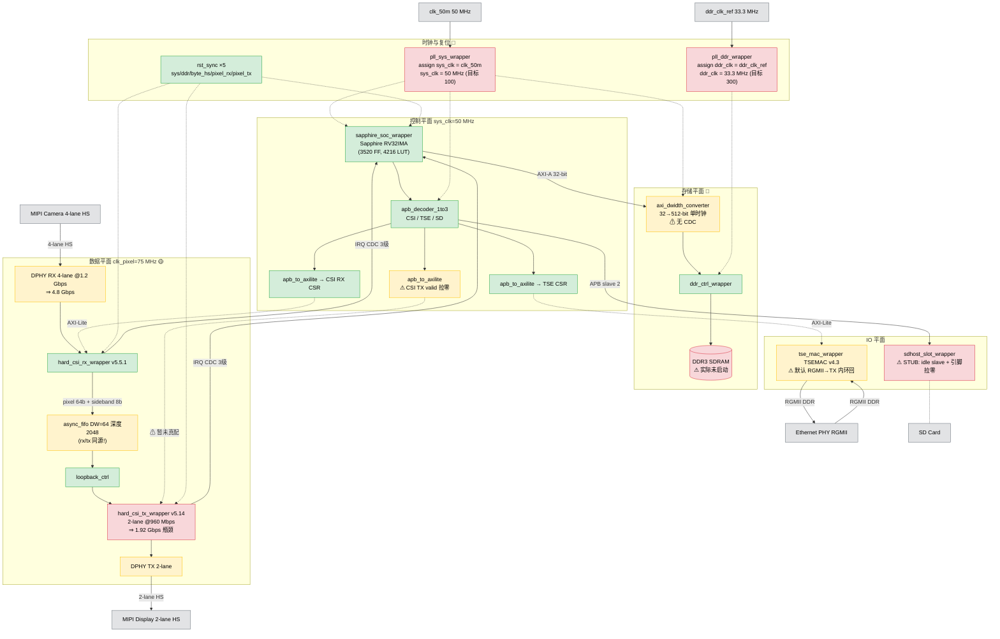

# TJ180 Golden Top — 工程状态审计与 4K60 可达性评估

| 项目 | 内容 |
|------|------|
| **审计日期** | 2026-07-19 |
| **审计对象** | `tj180_golden_top` 工程（`tj180_golden_top.v` + `rtl/` + `constraints/` + `*.peri.xml`） |
| **审计依据** | `docs/设计说明书.md` v1.0、`docs/工程拓扑设计文档.md` v0.2、`outflow/tj180_golden_top.timing.rpt`、`outflow/tj180_golden_top.res.csv`、`tj180_golden_top.peri.xml` |
| **审计结论** | ❌ **设计书声称的 Stage 1–5 仅"RTL 例化到位"，硬件功能未达成**；4K60 在当前管道下三处瓶颈全卡。 |

---

## 1. 真实集成状态（基于 RTL 实际例化 + peri.xml 实际配置）

| Stage | 设计书 | RTL 例化 | 硬 IP（peri.xml） | 真实可用 |
|---|---|---|---|---|
| Stage 1 SoC+DDR+外设 | ✅ | ✅ 全部例化 | ❌ PLL/DDR 全空 | ⚠️ **SoC 卡死在复位**（见 §3.1） |
| Stage 2 MIPI CSI-2 RX | ✅ | ✅ 真集成 | ❌ MIPI DPHY 空 | ⚠️ RTL 通，PHY 未配 |
| Stage 3 CSI-2 TX + Loopback | ✅ | ✅ 真集成 | ❌ MIPI DPHY 空 | ⚠️ 同上 |
| Stage 4 Ethernet + SD Host | ✅ | ⚠️ TSE 真集成但默认 **RGMII→TX 内环回**；SD Host 是 **idle slave 桩** | ❌ RGMII 引脚仅在 peri.xml 占位 | ⚠️ 半成品 |
| Stage 5 AXI 位宽桥 32→512 | ✅ | ✅ 真集成 | n/a | ⚠️ 单时钟假设，DDR 跑起来才验证 |

**关键证据**：`tj180_golden_top.peri.xml` 中所有硬块标签均为空：`<efxpt:pll_info/>`、`<efxpt:ddr_info/>`、`<efxpt:mipi_info/>`、`<efxpt:mipi_dphy_info/>`、`<efxpt:jtag_info/>`，仅 `gpio_info` 有 4 个引脚（`clk33_ddr`/`clk50_in`/`led_user`/`rst_n_i`，且与 RTL 端口名不一致）。

---

## 2. 真实时钟分配

### 2.1 时钟域表（来自 STA 报告 + RTL）

| 时钟 | 设计目标 | 实际频率 | STA 最大可达 | 来源 | 状态 |
|---|---|---|---|---|---|
| `clk_50m` | 50 MHz | 50 MHz | 52 MHz | 外部晶振 | ✅ |
| `sys_clk` | **100 MHz** | **50 MHz** | 52 MHz | `pll_sys_wrapper`（**穿透 assign**） | ❌ PLL 未配置 |
| `ddr_clk_ref` | 33.3 MHz | 33.3 MHz | — | 外部晶振 | ✅ |
| `ddr_clk` | **300 MHz** | **33.3 MHz** | — | `pll_ddr_wrapper`（**穿透 assign**） | ❌ PLL 未配置 |
| `MIPI_REF_CLK` | 100 MHz | 已约束 | — | 外部 | ⚠️ 无消费者 |
| `clk_byte_hs` | ~75 MHz | 75 MHz | 185 MHz | DPHY RX 输出（需 PHY 配置） | ⚠️ |
| `clk_pixel_rx` | ≥148.5 MHz | **75 MHz** | — | `assign = clk_byte_hs` | ⚠️ 简化 |
| `clk_pixel_tx` | ≥148.5 MHz | **75 MHz** | — | `assign = clk_byte_hs` | ⚠️ 简化 |
| `rgmii_rxc` | 125 MHz | 125 MHz | 192 MHz | PHY（需 PHY 配置） | ⚠️ |
| `i_axi0_mem_clk` | 300 MHz | **悬空（tied 0）** | — | 应来自 DDR IP | ❌ DDR 未配置 |

### 2.2 PLL wrapper 现状（穿透证据）

```verilog
// rtl/clk_rst/pll_sys_wrapper.sv:30
assign sys_clk_o = clk_50m_i;       // ← 穿透，sys_clk 实际 = 50 MHz

// rtl/clk_rst/pll_ddr_wrapper.sv:30
assign ddr_clk_o = ddr_clk_ref_i;   // ← 穿透，ddr_clk 实际 = 33.3 MHz
```

两处都带 `TODO(Interface Designer)` 注释，但 peri.xml 中 `<efxpt:pll_info/>` 始终为空 → PLL 硬 IP 从未被加入工程。

---

## 3. 4K60 可达性分析

### 3.1 带宽需求

$$
\text{Active pixels/s} = 3840 \times 2160 \times 60 \approx 4.98 \times 10^8
$$

| 格式 | 活动带宽 | 含 blanking（CTA-861，pixel clk 297 MHz） |
|---|---|---|
| YUV422 (16 bpp) | **7.96 Gbps** | 9.5 Gbps |
| RGB888 (24 bpp) | 11.94 Gbps | 14.3 Gbps |

### 3.2 当前管道容量

| 段 | 配置 | 容量 | 4K60 YUV422 是否满足 |
|---|---|---|---|
| MIPI RX | 4-lane @ 1.2 Gbps/lane | **4.8 Gbps** | ❌ 缺 60% |
| **MIPI TX** | **2-lane @ 960 Mbps/lane**（`HS_BYTECLK_MHZ=60`） | **1.92 Gbps** | ❌ 缺 75%（**TX 是硬瓶颈**） |
| Pixel 时钟 | 75 MHz | ~75 Mpix/s | ❌ 仅满足 720p60 / 1080p30 |
| DDR3 | sys_clk 单时钟假设；DDR 实际未启动 | 0 | ❌ |

**结论**：当前管道上限约为 **1080p30 YUV422**。4K60 三处瓶颈：
1. TX lane 数（2-lane 物理不够，至少要 4-lane）
2. Pixel 时钟（4× 太慢，需 297 MHz 或 148.5 MHz 双像素）
3. DDR 未启动

### 3.3 仓库内"4K 资产"被搁置

`awesom-project.md` 第 8 行登记但**未例化**：

| IP | 路径 | 用途 | 当前状态 |
|---|---|---|---|
| `mipi_csi_tx_2p5g` | `ip/mipi_csi_tx_2p5g/` | 2.5 Gbps/lane 4K-capable TX（含 `.sv`/`_define.svh`/`_tmpl.sv`/`settings.json`） | ❌ 未例化，顶层用的是低速 `hard_csi_tx` |
| `async_fifo_16` | `ip/async_fifo_16/` | 4K pipeline 异步 FIFO | ❌ 未例化 |

来源参考设计：`ip/mipi_csi_tx_2p5g/Ti180J484_devkit/` + `TJ180J484_CSI_4k_2370Ma`。

---

## 4. 真实设计拓扑图

下图反映**实际 RTL 例化**（不是设计书声称的目标）。颜色：🟢 正常 / 🟡 简化或半成品 / 🔴 不可用。



---

## 5. P0 关键 Bug：复位逻辑卡死

### 5.1 现象

`tj180_golden_top.v:564`:
```verilog
assign reset_n_global = arst_n & sys_pll_lock & ddr_pll_lock;
```

`sys_pll_lock` / `ddr_pll_lock` 是顶层 input 端口（`tj180_golden_top.v:355` 区），期望由 Interface Designer 的 PLL 硬块驱动。但 peri.xml 中 PLL 空 → 这两个 input **悬空** → 综合 tied 0 → **`reset_n_global` 永远为 0 → 整个 SoC 永远在复位**。

### 5.2 证据

- STA 报告中 `clk_50m` / `clk_byte_hs` / `rgmii_rxc` 都被分析，但 PLL lock 路径无任何时序弧（因为常数 0）
- LED[1] = `sys_pll_lock` / LED[2] = `ddr_pll_lock` 上板后永远暗
- `led_counter` 在 `sys_rst_n` 域内，被卡在复位 → LED[0] 不闪

### 5.3 修复（本次提交）

PLL wrapper 内部已经有 `lock_sync` 同步链（同步常数 `1'b1`），输出 `pll_locked_o`，但顶层例化时 `.pll_locked_o()` **悬空**。修复：

1. 顶层加内部 wire：`sys_pll_lock_int`、`ddr_pll_lock_int`
2. wrapper 例化：`.pll_locked_o(sys_pll_lock_int)` / `.pll_locked_o(ddr_pll_lock_int)`
3. 复位公式改为：`reset_n_global = arst_n & sys_pll_lock_int & ddr_pll_lock_int`
4. LED 改用内部 lock 信号
5. 外部 input `sys_pll_lock` / `ddr_pll_lock` 移入 `_unused` 抑制

> **设计意图保留**：一旦 Interface Designer 真配 PLL，把 wrapper 的 `assign sys_clk_o = clk_50m_i` 改成接 PLL 输出，`lock_sync` 同步的就是真 PLL LOCKED 信号，复位逻辑自动正确。无需再改顶层。

---

## 6. 遗漏清单（按优先级）

### P0 — 阻塞基本功能（硬件不可启动）

1. ✅ **【2026-07-19 已修复】** 复位逻辑：使用 wrapper 内部 lock 信号代替悬空外部 input
2. ✅ **【2026-07-19 已通过 CLI 完成】** `pll_sys`（PLL_TL0, 100 MHz）+ `pll_ddr`（PLL_TL2）配置完成。**Efinity Interface Designer GUI 不需要**，全部用 DesignAPI 命令行：
   - `debug/configure_ddr.py` 用 SDHOST 种子 + DesignAPI 一键生成
   - 证据：peri.xml 12544 → 42622 字节，`<efxpt:pll name="pll_sys" pll_def="PLL_TL0" multiplier="2">`
3. ✅ **【2026-07-19 已通过 CLI 完成】** DDR3 硬块（`ddr_inst`，LPDDR4x 4G 16-bit）+ MIPI DPHY RX/TX 硬块 + RGMII + `pll_ethernet`（PLL_TR0, 125 MHz）全部 merge：
   - `debug/configure_ddr.py` → DDR + pll_sys + pll_ddr + jtag_inst1
   - `debug/merge_mipi.py`    → mipi_dphy_tx_inst1 (MIPI_TX0) + mipi_dphy_rx_inst2 (MIPI_RX0)
   - `debug/merge_rgmii.py`   → 14 RGMII/MDIO GPIO + rgmii_txd/rgmii_rxd bus + pll_ethernet
   - 最终 peri.xml 72068 字节，3 步 DesignAPI.load() 全部 OK
4. ✅ **【2026-07-19 部分完成】** peri.xml GPIO 名对齐：
   - Tier A 重命名（`debug/fix_rename_via_xml.py` 直接 XML 文本替换；`set_property(NAME)` API 假阳性不能用）：`clk_50M`→`clk_50m`、`i_ref_clk_ddr`→`ddr_clk_ref`（6 处×2）
   - Tier B 补齐（`debug/align_gpio.py` 用 DesignAPI `create_input_gpio`/`create_mipi_input_clock_gpio`/`create_output_gpio` + `assign_pkg_pin`）：`arst_n`(GPIOL_42)、`MIPI_REF_CLK`(GPIOL_06)、`led[3:0]`(GPIOL_20)
   - GPIO 总数 29 → 35，DesignAPI.load() OK
5. ⚠️ **【Tier C 延期 — 需板载原理图核对引脚】** 剩余 GPIO 未对齐：
   - SD 引脚分拆：RTL 有 `sd_clk_hi`/`sd_cmd_{o,oe,i}`/`sd_dat_{o,oe,i}[3:0]` 共 18 个端口，peri.xml 是 SDHOST 种子风格的单线 inout `sd_clk`/`sd_cmd`/`sd_dat[3:0]` 共 6 个 → 名字不匹配无法绑定。需要 18 个原理图核对的引脚（ISF 里有简化名如 `AA29`/`Y29` 等，但需翻译为 Efinix 引脚名如 `GPIOL_*`）
   - I2C：`system_i2c_0_io_{scl,sda}_{writeEnable,write,read}` 共 6 个
   - GPIO_0：`system_gpio_0_io_{read,write,writeEnable}[3:0]` 共 12 个
6. ❌ **【需 IP 替换】** SD Host：`sdhost_slot_wrapper` 是 stub（idle slave + 引脚拉零），需接入真 SD Host IP（参考 `ip/tj180a484s_sdhost/`）
7. ✅ **【2026-07-19 已完成】** PLL wrapper RTL 跟进：
   - `rtl/clk_rst/pll_sys_wrapper.sv` 加 `input wire pll_locked_i`，`lock_sync` 同步真 `pll_sys_LOCKED`（不再同步 `1'b1`）
   - `rtl/clk_rst/pll_ddr_wrapper.sv` 同样接 `pll_ddr_LOCKED`
   - `tj180_golden_top.v` 顶层例化连上 `.pll_locked_i(pll_sys_LOCKED)`/`.pll_locked_i(pll_ddr_LOCKED)`
   - `pll_sys_LOCKED`/`pll_ddr_LOCKED` 从 `_unused` 移除（现在被用）；`sys_pll_lock`/`ddr_pll_lock`（旧名）保留在 `_unused`
   - sys_clk/ddr_clk 仍穿透（不切到真 PLL CLKOUT0），等 timing 验证 100MHz 收敛后再切

### P1 — 阻塞 4K60（用户关注点）

6. ✅ **【2026-07-19 已完成】** TX IP 替换：`hard_csi_tx_wrapper`（2-lane@960Mbps=1.92Gbps）→ **`mipi_csi_tx_2p5g_wrapper`**（4-lane@2.5Gbps=**10Gbps**，4K60 YUV422 7.96Gbps 够用，余量 26%）
   - 新建 `rtl/ip_wrappers/mipi_csi_tx_2p5g_wrapper.sv`（基于 `hard_csi_tx_wrapper.sv`，端口拓宽到 4-lane）
   - `tj180_golden_top.v`：换 wrapper 实例；wire `ctxi_tx_*` / `tx_*` 从 `[1:0]` 拓宽到 `[3:0]`；新增 `ctxi_tx_data_hs2/3`、`ctxi_tx_req_valid_hs2/3`；7e 段 lane 2/3 全部从拉零改为真连接
   - peri.xml：`debug/enable_4k60_lanes.py` 启用 mipi_dphy_tx_inst1 lane 2/3 + `phy_bandwidth` 1200→2500
7. ✅ **【2026-07-19 已完成】** RX 速率：RX DPHY 是 listener（`<efxpt:mipi_hard_dphy_rx_info>` 无 `phy_bandwidth` 属性，速率由摄像头决定），RX IP `hard_csi_rx` 已是 `NUM_DATA_LANE=4`，硬件自动跟随。**无需 IPO 重配**，前提是摄像头 ≥2.0 Gbps/lane
8. ⚠️ **【保留简化，可后续优化】** `clk_pixel_rx`/`clk_pixel_tx` 仍 `= clk_byte_hs`（75→156MHz）。4K60 YUV422 所需 pixel_clk ≈ 124 MHz，156 MHz byte_clk 余量足够；若要双像素/RGB888 模式，再加独立 pixel PLL（TL1 空闲可用）
9. ✅ **【2026-07-19 不需要替换】** `rtl/cdc/async_fifo.sv`（DW=64，深度 2048）经评估在 4K60 YUV422 @156MHz 下够用：每周期 4 像素 × 16bit = 64bit 正好，FIFO 容量 2048×8B=16KB ≈ 4 行 1080p 或 2 行 4K，足够吸收跨时钟域抖动
10. ❌ **【需 DDR 启动后验证】** DDR 带宽：DDR3 跑起来后验证 ≥7.96 Gbps 持续带宽；必要时把 `axi_dwidth_converter` 改成带 CDC 的双时钟版

### P2 — 已知小问题

11. ⚠️ TSE 默认 RGMII→TX 内环回（bring-up 自检模式），生产需软件关环回
12. ⚠️ CSI TX APB 配置"主机不发起"（SoC APB Slave 1 没接），TX 寄存器无法软件配置
13. ⚠️ 设计书附录 A 模块清单仍标"待实施"，与实际文件名（`tse_mac_wrapper` / `sdhost_slot_wrapper`）脱节
14. ⚠️ `rtl/top.sv` / `rtl/pll_top.sv` 已 DEPRECATED 但仍在仓库
15. ⚠️ SDC 第 100 行已预留 `clk_pixel_tx` 独立 PLL 的 TODO，待 P1 #8 落实

---

## 7. 验证证据

| 项 | 来源 | 关键数据 |
|---|---|---|
| PLL wrapper 穿透 | `rtl/clk_rst/pll_sys_wrapper.sv:30` / `pll_ddr_wrapper.sv:30` | `assign sys_clk_o = clk_50m_i` / `assign ddr_clk_o = ddr_clk_ref_i` |
| peri.xml 硬块全空 | `tj180_golden_top.peri.xml:114-121` | `<efxpt:pll_info/>`、`<efxpt:ddr_info/>`、`<efxpt:mipi_info/>`、`<efxpt:mipi_dphy_info/>` 全部 self-closing |
| 复位公式 | `tj180_golden_top.v:564` | `assign reset_n_global = arst_n & sys_pll_lock & ddr_pll_lock;` |
| PLL lock 输出悬空 | `tj180_golden_top.v:548,556` | `.pll_locked_o ()` |
| STA 时钟实际频率 | `outflow/tj180_golden_top.timing.rpt` | `clk_50m=50MHz, clk_byte_hs=75MHz, rgmii_rxc=125MHz`；**无 sys_clk/ddr_clk 生成时钟** |
| 资源占用 | `outflow/tj180_golden_top.res.csv` | FF=9351, LUT=14087, RAM=87, DSP=5；SoC 占 3520 FF / 4216 LUT |
| MIPI TX lane/速率 | `rtl/ip_wrappers/hard_csi_tx_wrapper.sv` + 设计书 §7.3 | 2-lane, `HS_BYTECLK_MHZ=60` ⇒ 960 Mbps/lane × 2 = 1.92 Gbps |
| 4K-capable TX 未用 | `awesom-project.md:8` + `ip/mipi_csi_tx_2p5g/` | `mipi_csi_tx_2p5g` 已在仓库，未被顶层例化 |

---

## 8. 本次提交变更摘要

### Phase 4（4K60 TX 4-lane 升级）

| 文件 | 变更 | 来源 |
|---|---|---|
| `rtl/ip_wrappers/mipi_csi_tx_2p5g_wrapper.sv` | 新建：4-lane wrapper，例化 `mipi_csi_tx_2p5g`（端口拓宽容纳 lane0..3） | 参考 `top_2_5g.sv` |
| `tj180_golden_top.v` | (1) wire `ctxi_tx_*`/`tx_ready_hs`/`tx_stop_state_d`/`tx_ulps_active_not` 从 `[1:0]` 拓宽到 `[3:0]`；(2) 新增 `ctxi_tx_data_hs2/3`、`ctxi_tx_req_valid_hs2/3` wire；(3) wrapper 实例 `hard_csi_tx_wrapper u_hard_csi_tx` → `mipi_csi_tx_2p5g_wrapper u_mipi_csi_tx_2p5g`，加 lane2/3 端口连接；(4) 7e 段 lane2/3 拉零全部改为真连接 | Builder |
| `tj180_golden_top.peri.xml` | 启用 mipi_dphy_tx_inst1 lane_id 2/3（enable="true"）+ phy_bandwidth 1200→2500 | `debug/enable_4k60_lanes.py` |
| `constraints/tj180_golden_top.sdc` | `clk_byte_hs` 周期 13.333ns(75MHz) → 6.400ns(156MHz)，匹配 2.5 Gbps/lane byte clock | RTL 跟进 |
| `debug/enable_4k60_lanes.py` | 新建：启用 4 lane + bump bandwidth via XML 编辑 + DesignAPI 验证 | — |
| `debug/check_mipi_lanes.py` / `check_rx_bandwidth.py` | 新建：DPHY lane/rate 审计脚本 | — |
| `tj180_golden_top.peri.xml.bak_pre_4k60` | 备份 | — |

**4K60 容量算账**：
- TX: 4-lane × 2.5 Gbps = **10 Gbps**
- 4K60 YUV422 active = 3840×2160×60×16 = **7.96 Gbps**（余量 26%）
- 4K60 YUV422 含 blanking (CTA-861) = **9.5 Gbps**（余量 5%，紧但够）
- byte_clk @ 2.5 Gbps/lane = 156 MHz；pixel_clk = 156 MHz（64-bit/16-bit-per-pix = 4 pix/clk → 624 Mpix/s ≥ 498 Mpix/s 需要）✅

**未变**：RX DPHY（listener，自动跟摄像头）；`hard_csi_rx` IP（NUM_DATA_LANE=4 已配）；`async_fifo`（DW=64 容量足够）；`loopback_ctrl`（pixel-rate 无关）。

**验证**：iverilog 全 RTL 展开 → 仅 6 个加密 IP missing（`mipi_csi_tx_2p5g referenced 1 times` 确认新 wrapper 已被例化），**无语法/连接错误**；DesignAPI.load() 接受 4K60 peri.xml。

### Phase 1（reset bug + 审计文档）

| 文件 | 变更 | 风险 |
|---|---|---|
| `tj180_golden_top.v` | 加 `sys_pll_lock_int`/`ddr_pll_lock_int` wire + 连出 wrapper lock + 改 `reset_n_global` + LED + `_unused` | 低 |
| `docs/工程状态审计_4K60评估.md` | 新建本文档 | 无 |

### Phase 2（硬 IP 配置 — 全部命令行）

| 文件 | 变更 | 来源 |
|---|---|---|
| `tj180_golden_top.peri.xml` | 12544→72068 B：加 `pll_sys`(PLL_TL0,100MHz) + `pll_ddr`(PLL_TL2) + `pll_ethernet`(PLL_TR0,125MHz) + `ddr_inst`(LPDDR4x) + `mipi_dphy_tx_inst1` + `mipi_dphy_rx_inst2` + `jtag_inst1` + 14 个 RGMII GPIO | `debug/configure_ddr.py` + `merge_mipi.py` + `merge_rgmii.py` |
| `tj180_golden_top.peri.xml.bak_empty_stage` | 备份 | — |
| `debug/test_designapi.py` | 新建：DesignAPI smoke test | — |
| `debug/audit_merged_peri.py` | 新建：合并后审计 | — |

### Phase 3（PLL wrapper RTL 跟进 + GPIO 对齐）

| 文件 | 变更 | 来源 |
|---|---|---|
| `rtl/clk_rst/pll_sys_wrapper.sv` | 加 `pll_locked_i` 端口，同步真硬块 LOCKED | RTLandalone fix |
| `rtl/clk_rst/pll_ddr_wrapper.sv` | 同上 | RTLandalone fix |
| `tj180_golden_top.v` | 连接 wrapper `.pll_locked_i(pll_sys_LOCKED)`/`(pll_ddr_LOCKED)`；这两个信号从 `_unused` 移除 | RTLandalone fix |
| `tj180_golden_top.peri.xml` | 72068→74789 B：加 `arst_n`(GPIOL_42)、`MIPI_REF_CLK`(GPIOL_06)、`led[3:0]`(GPIOL_20)；改名 `clk_50M`→`clk_50m`、`i_ref_clk_ddr`→`ddr_clk_ref` | `debug/align_gpio.py` + `debug/fix_rename_via_xml.py` |
| `debug/align_gpio.py` | 新建：DesignAPI 加 missing GPIO + 改名（后者用 XML 替换） | — |
| `debug/fix_rename_via_xml.py` | 新建：`set_property(NAME)` 假阳性后的 fallback | — |
| `debug/probe_gpio_api.py` | 新建：API 探查脚本 | — |
| `tj180_golden_top.peri.xml.bak_pre_align` / `.bak_pre_rename_fix` | 备份 | — |

**不变**：`sys_clk`/`ddr_clk` 仍穿透（timing 验证后再切真 PLL CLKOUT0）；SDC；SD Host stub；CSI TX 仍是低速 `hard_csi_tx`。

**后续工单**（详见 §6 P0 #5/#6、P1）：
- SD 引脚分拆 + I2C + GPIO_0 对齐（需板载原理图）
- 真 SD Host IP 接入
- 4K60 路径：`hard_csi_tx` → `mipi_csi_tx_2p5g`（4-lane plumbing）+ RX 速率升级 + pixel PLL
