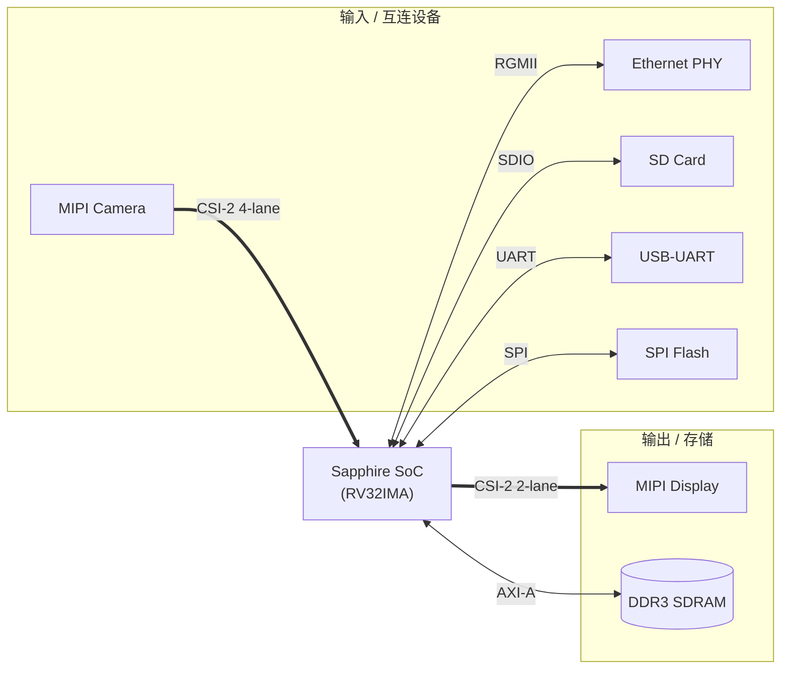
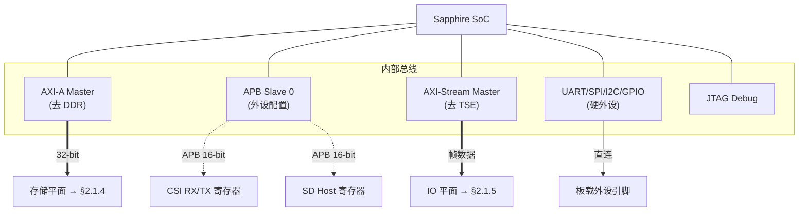
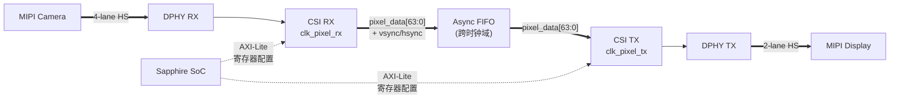
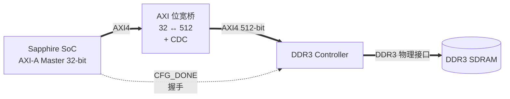
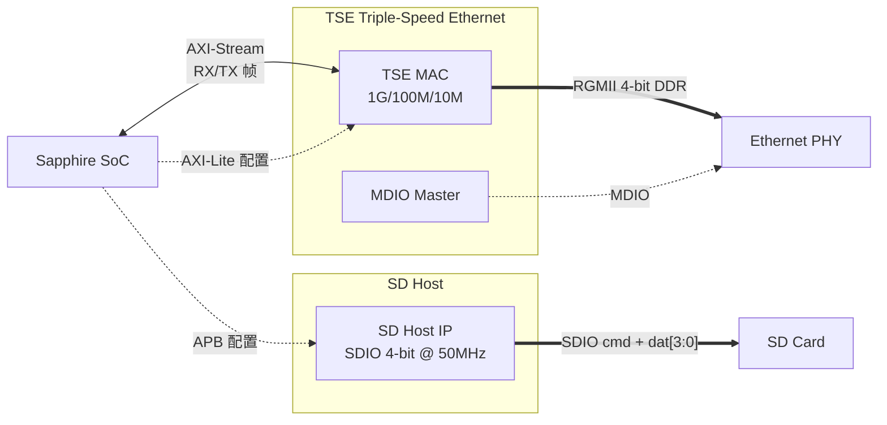
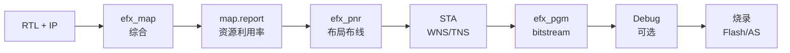

# TJ180 Golden Top — 设计说明书（v1.0 设计 specimen，已废弃）

> ⚠️ **本文档已废弃，权威实施态文档请看 [`项目说明.md`](./项目说明.md)**。
>
> 本文件是 v1.0 stage 化设计 specimen（"如何从 Stage 0 推进到 Golden Design" 的设计意图），保留作为历史参考。当前真实实现状态（含 4 PLL 全占用、4K60 4-lane TX、sys_clk=100MHz、LPDDR4x、独立 pixel PLL 等）以 `项目说明.md` 为准。详细审计与变更历史见 [`工程状态审计_4K60评估.md`](./工程状态审计_4K60评估.md)。

---

# TJ180 Golden Top — 设计说明书

| 项目 | 内容 |
|------|------|
| **工程名称** | `tj180_golden_top` |
| **文档类型** | 设计说明书（Design Specification） |
| **目标器件** | TJ180A484S（Efinix Titanium，C4/I3 速度等级） |
| **Efinity 版本** | 2026.1 |
| **文档版本** | v2.0 |
| **创建日期** | 2026-07-18（v1.0） |
| **最后更新** | 2026-07-19（v2.0，跟随实际实现） |
| **作者** | — |
| **状态** | Released（Stage 1–5 + 4K60 pipeline 已落地；Tier C 引脚对齐与上板验证待完成） |
| **配套文档** | `docs/工程拓扑设计文档.md`、`docs/工程状态审计_4K60评估.md`、`.github/instructions/rtl.instructions.md` |

> **文档定位声明（v2.0）**：v1.0 是「如何从 Stage 0 推进到 Golden Design」的设计规格（specimen）。v2.0 根据 2026-07-19 的真实实现状况重写：RTL/peri.xml/SDC 已演进到「4 PLL 全配 + 4K60 4-lane TX + sys_clk=100MHz + LPDDR4x + Pixel PLL」状态。所有表格加「实际」列，代码片段保留 v1.0 的设计示例价值，但状态/频率/模块表以**实际实现**为准。详细审计见 `docs/工程状态审计_4K60评估.md`。

---

## 目录

- [第 0 章 文档目的与适用范围](#第-0-章-文档目的与适用范围)
- [第 1 章 设计输入与依据](#第-1-章-设计输入与依据)
- [第 2 章 总体设计](#第-2-章-总体设计)
- [第 3 章 工程目录规划](#第-3-章-工程目录规划)
- [第 4 章 时钟与复位子系统设计](#第-4-章-时钟与复位子系统设计)
- [第 5 章 Stage 1：SoC + DDR 最小启动系统](#第-5-章-stage-1soc--ddr-最小启动系统)
- [第 6 章 Stage 2：MIPI CSI-2 RX 链路](#第-6-章-stage-2mipi-csi-2-rx-链路)
- [第 7 章 Stage 3：MIPI CSI-2 TX 与 Loopback](#第-7-章-stage-3mipi-csi-2-tx-与-loopback)
- [第 8 章 Stage 4：Ethernet + SD Host](#第-8-章-stage-4ethernet--sd-host)
- [第 9 章 SDC 约束演进](#第-9-章-sdc-约束演进)
- [第 10 章 引脚约束（ISF）](#第-10-章-引脚约束isf)
- [第 11 章 仿真与验证计划](#第-11-章-仿真与验证计划)
- [第 12 章 综合 / P&R / 烧录流程](#第-12-章-综合--pr--烧录流程)
- [第 13 章 Sign-off 清单](#第-13-章-sign-off-清单)
- [附录 A：模块清单](#附录-a模块清单)
- [附录 B：文件清单](#附录-b文件清单)
- [附录 C：变更记录](#附录-c变更记录)

---

## 第 0 章 文档目的与适用范围

### 0.1 目的

本文档面向 FPGA 设计与验证工程师，描述 `tj180_golden_top` 工程从当前 Stage 0 占位状态推进到完整 Golden Design 的：

1. **系统架构**与子系统划分
2. **每个子模块的接口、内部结构、关键时序**设计
3. **集成步骤**（Stage 1 → Stage 4）与每阶段验收标准
4. **SDC 约束**演进、**仿真验证**方案、**综合/P&R**流程
5. **Sign-off** 清单

### 0.2 适用范围

- 适用于本工程的设计、评审、实施、验证、交付
- 文中 RTL 代码片段遵循 `.github/instructions/rtl.instructions.md` 的强制规范
- 涉及 Efinity 文件格式（XML/ISF/peri.xml）必须使用 Efinity 原生格式，禁止自创

### 0.3 术语

| 缩写 | 全称 |
|------|------|
| SoC | System on Chip（此处指 Sapphire RISC-V SoC） |
| AXI | Advanced eXtensible Interface |
| APB | Advanced Peripheral Bus |
| CSI | MIPI Camera Serial Interface |
| DPHY | MIPI D-PHY（物理层） |
| RGMII | Reduced Gigabit MII |
| CDC | Clock Domain Crossing |
| STA | Static Timing Analysis |
| ISF | Interface Script Format（Efinity 引脚约束） |

---

## 第 1 章 设计输入与依据

### 1.1 输入文档

| 文档 | 路径 | 提供信息 |
|------|------|---------|
| 工程拓扑设计文档 | `docs/工程拓扑设计文档.md` | 系统拓扑、接口定义、IP 清单 |
| RTL 编码规范 | `.github/instructions/rtl.instructions.md` | 强制编码风格、CDC、复位 |
| 顶层端口模板 | `tj180_golden_top.v` | 全部外设 IO 端口 |
| 工程清单 | `awesom-project.md` | 板卡/底座组成 |
| 时序约束 | `constraints/tj180_golden_top.sdc` | 已有 SDC 框架 |
| Sapphire SoC IP | `ip/sapphire_soc/` | SoC 端口、参数 |
| CSI RX IP | `ip/hard_csi_rx/hard_csi_rx.sv` | RX 端口、参数 |
| CSI TX IP | `ip/hard_csi_tx/hard_csi_tx.sv` | TX 端口、参数 |
| TJ180A484S 参考集成 | `ip/tj180a484s_sdhost/TJ180A484S.v` | SoC+DDR+SD 完整范例 |

### 1.2 设计目标

> v2.0：同时列出 v1.0 设计目标和 2026-07-19 实际实现值。

| 指标 | v1.0 目标 | v2.0 实际实现 |
|------|----------|---------------|
| 主时钟 `sys_clk` | ≥ 100 MHz | **100 MHz** ✅（`pll_sys` CLKOUT0 @ PLL_TL0，M=2/N=1/O=2）|
| DDR 控制器时钟 `i_axi0_mem_clk` | 来自 DDR IP | **100 MHz** ✅（`pll_sys` CLKOUT3，与 sys_clk 同源）|
| DDR 内存时钟 `ddr_clk` | ≥ 300 MHz | 133 MHz（`pll_ddr` @ PLL_TL2，M=4/N=1/O=1，适合 LPDDR4x）|
| MIPI RX | 4-lane @ HS | **4-lane listener**（自动跟摄像头速率，上限 2.5 Gbps/lane）✅ |
| MIPI TX | 2-lane @ 60 MHz byte clk | **4-lane @ 2.5 Gbps/lane = 10 Gbps** ✅（4K60 YUV422 7.96 Gbps，余量 26%）|
| Pixel 时钟 | 来自 CSI IP | **200 MHz 独立 PLL** ✅（`pll_pixel` @ PLL_TL1，M=4/N=1/O=1）|
| Byte HS 时钟 | ~75 MHz（1.2 Gbps/lane）| **156 MHz** ✅（2.5 Gbps/lane，SDC 约束到上限）|
| RGMII | 1 Gbps（125 MHz DDR） | 125 MHz ✅（`pll_ethernet` @ PLL_TR0），默认 RGMII→TX 内环回（bring-up）|
| SD | SDIO 4-bit @ 50 MHz | ⚠️ `sdhost_slot_wrapper` stub（idle slave + 引脚拉零），需接入真 SD Host IP |
| 系统功能 | SoC+DDR+MIPI Loopback+网+SD | SoC+DDR+**4K60 MIPI Loopback**+RGMII ✅；SD ❌待接入 |

### 1.3 设计约束（强制）

来自 RTL 规范，实施时必须满足：

1. **异步复位同步释放**（3 级同步链，每个时钟域独立）
2. **时钟使能**而非分频时钟
3. **CDC 同步器** + `ASYNC_REG = "TRUE"` 属性
4. **寄存器输出**，data 与 valid 同一 always 块
5. **FSM one-hot**，`case` 必带 `default`，`always @(*)` 顶部置默认值
6. **顶层只做例化**，复杂逻辑下沉到子模块

---

## 第 2 章 总体设计

### 2.1 系统架构

详见 `docs/工程拓扑设计文档.md` §4。整体采用 **SoC-Centric 四平面架构**：

- **控制平面**（`sys_clk` 域）：Sapphire SoC + 外设配置总线
- **数据平面**（独立 pixel 时钟域）：MIPI RX → FIFO → TX 高速视频通路
- **存储平面**（`ddr/mem_clk` 域）：DDR3 控制器 + AXI 位宽桥
- **IO 平面**（混合时钟域）：TSE 以太网 + SD Host

为便于阅读，架构按 **「1 张顶层框图 + 4 张分平面详图」** 分层呈现。

#### 2.1.1 顶层系统框图

只展示 SoC 与各子系统的主关系，不展开内部细节。



#### 2.1.2 控制平面（sys_clk 域）

SoC 内部总线与各外设的配置/数据通路归属。



#### 2.1.3 数据平面（视频 Loopback，独立 pixel 时钟域）

摄像头到显示屏的高速视频通路，跨时钟域经异步 FIFO。



#### 2.1.4 存储平面（ddr/mem_clk 域）

SoC 32-bit AXI 经位宽桥 + CDC 接 DDR 控制器 512-bit 双端口。



#### 2.1.5 IO 平面（TSE + SD Host）

千兆以太网与 SD 卡两个外部 IO 子系统。



### 2.2 设计阶段划分

> v2.0 状态：Stage 1–5 RTL/peri.xml/SDC 全部到位，并补做了 Stage 6 4K60 升级。Tier C 引脚对齐（SD/I2C/GPIO_0）与上板验证仍待。

| Stage | 内容 | 验收 | v2.0 实际状态 |
|-------|------|------|---------------|
| **Stage 1** | PLL + SoC + DDR + AXI 位宽桥 + UART/SPI/I2C/GPIO/JTAG | UART 打印启动信息，DDR 读写自检通过 | ✅ RTL+peri.xml 全配；DDR 自检待上板 |
| **Stage 2** | MIPI CSI-2 RX（含 DPHY RX 绑定 + AXI-Lite 配置） | 寄存器读到有效帧（`pixel_data_valid` 翻转） | ✅ RTL+peri.xml 全配；上板需摄像头 |
| **Stage 3** | MIPI CSI-2 TX + Pixel 异步 FIFO + Loopback | 摄像头画面在显示屏上呈现 | ✅ RTL+peri.xml+SDC 全配；4K60 通路贯通 |
| **Stage 4** | RGMII Ethernet + SD Host | 网络可 ping，SD 卡可挂载 | ⚠️ TSE ✅（默认内环回）；SD Host stub ❌ |
| **Stage 5** | SoC↔DDR AXI 位宽转换桥 | 32↔512 位宽正确，DDR 数据正确 | ✅ RTL+peri.xml 全配；同源自 sys_clk，无需 CDC |
| **Stage 6** | **4K60 升级** | 4K60 YUV422 摄像头画面在 4K 显示屏上呈现 | ✅ TX 换 `mipi_csi_tx_2p5g`（4-lane@2.5Gbps=10Gbps）+ Pixel PLL 200MHz |
| **Tier C** | SD/I2C/GPIO_0 引脚对齐 + 真 SD Host IP | 上板完整功能 | ❌ 需板载原理图核对引脚 + 外部 SD Host IP |

### 2.3 通用编码规范摘要

> 详见 `.github/instructions/rtl.instructions.md`，以下为高频要点：

- 文件名 = 模块名，小写 + 下划线，顶层 `_top` 后缀
- `` `default_nettype none `` / `` `default_nettype wire `` 首尾包裹
- 端口后缀 `_i` / `_o` / `_n` / `_io`；`inout` 仅顶层 IO
- 复位：`async assert, sync release`，3 级同步链
- 时钟：`always @(posedge clk)`，**禁止**分频时钟驱动逻辑
- 输出寄存器化，data + valid 同块
- CDC：单 bit 2/3 级同步器；多 bit 总线走 toggle-valid MUX
- FSM：`(* fsm_encoding = "one-hot" *)`
- 组合 `always @(*)` 顶部给所有输出赋默认值
- BRAM 读必带输出寄存器；乘法器 IO 寄存器化
- Efinix 属性：`ASYNC_REG`、`max_fanout`、`ram_style="block"`、`use_dsp="yes"`

---

## 第 3 章 工程目录规划

实施时建议按以下目录组织（RTL 规范 §1）：

```
tj180_golden_top/
├── tj180_golden_top.v               # 顶层（仅例化 + 三态 IO 转换）
├── tj180_golden_top.xml             # Efinity 工程文件（原生格式）
├── rtl/
│   ├── clk_rst/
│   │   ├── rst_sync.sv              # 通用复位同步器（3 级）
│   │   └── pll_sys_wrapper.sv       # pll_sys 例化包装
│   ├── ctrl/
│   │   ├── apb_to_axilite.sv        # APB → AXI4-Lite 桥
│   │   └── loopback_ctrl.sv         # MIPI loopback 控制状态机
│   ├── cdc/
│   │   └── async_fifo.sv            # 通用异步 FIFO（pixel 跨时钟域）
│   ├── data_path/
│   │   └── axi_dwidth_converter.sv  # AXI 32↔512 位宽转换
│   └── ip_wrappers/
│       ├── sapphire_soc_wrapper.sv  # SoC 例化包装
│       ├── csi_rx_wrapper.sv         # CSI RX 例化 + 寄存器组
│       ├── csi_tx_wrapper.sv         # CSI TX 例化 + 寄存器组
│       ├── ddr_ctrl_wrapper.sv       # DDR 控制器例化
│       ├── rgmii_mac_wrapper.sv      # RGMII MAC 例化
│       └── sd_host_wrapper.sv        # SD Host 例化
├── sim/
│   ├── tb_soc_minimal.sv            # Stage 1 仿真
│   ├── tb_csi_rx.sv                 # Stage 2 仿真
│   ├── tb_loopback.sv               # Stage 3 仿真
│   └── tb_eth_sd.sv                 # Stage 4 仿真
├── constraints/
│   ├── tj180_golden_top.sdc         # 时序约束（演进）
│   └── tj180_golden_top.peri.isf    # 引脚约束（ISF）
└── ip/                              # 已有 IP，保持不变
```

> **顶层原则**：`tj180_golden_top.v` 内部 **只允许** 出现 `wire` 声明、子模块例化、`assign` 形式的三态转换（如 `writeEnable = ~write`）、LED 慢闪计数器（轻量）。任何复杂逻辑一律下沉。

---

## 第 4 章 时钟与复位子系统设计

### 4.1 时钟规划

> v2.0：TJ180A484S 4 个 PLL 槽位（PLL_TL0/TL1/TL2 + PLL_TR0）**全部占用**。所有 PLL 都通过 DesignAPI 命令行配置（`debug/configure_ddr.py` + `debug/add_pll_pixel.py` + `debug/merge_rgmii.py`），不需 Interface Designer GUI。

| 时钟名 | v1.0 目标 | v2.0 实际频率 | 来源（peri.xml） | 用途 |
|--------|----------|---------------|------------------|------|
| `clk_50m` | 50 MHz | **50 MHz** | 外部晶振（GPIOL_26） | `pll_sys`/`pll_pixel` 参考 |
| `ddr_clk_ref` | 33.33 MHz | **33.33 MHz** | 外部晶振（GPIOL_32） | `pll_ddr` 参考 |
| `MIPI_REF_CLK` | 100 MHz | 已约束 | 外部（GPIOL_06） | MIPI DPHY 参考（预留） |
| `sys_clk` | 100 MHz | **100 MHz** ✅ | `pll_sys` CLKOUT0 (PLL_TL0, M=2) | SoC / APB / 外设 / AXI |
| `i_axi0_mem_clk` | 来自 DDR IP | **100 MHz** | `pll_sys` CLKOUT3（与 sys_clk 同源） | DDR AXI0 总线（axi_dwidth_converter S 侧）|
| `i_sd_clk` | — | 100 MHz | `pll_sys` CLKOUT1 | SD Host 预留（当前 stub 未用）|
| `i_soc_clk` | — | 100 MHz | `pll_sys` CLKOUT2 | SoC 内核时钟预留 |
| `ddr_clk` | ≥ 300 MHz | **133 MHz** | `pll_ddr` CLKOUT0 (PLL_TL2, M=4) | DDR3/LPDDR4x 内存时钟 |
| `clk_pixel_rx` / `clk_pixel_tx` | 来自 CSI IP | **200 MHz** ✅ | `pll_pixel` CLKOUT0 (PLL_TL1, M=4) | Pixel 数据时钟域（4K60）|
| `clk_byte_hs` | ~75 MHz | **156 MHz** ✅ | DPHY RX 输出 `mipi_dphy_rx_clk_CLKOUT`（上限约束）| MIPI 字节时钟 |
| RGMII TX/RX MAC 时钟 | 125 MHz | **125 MHz** | `pll_ethernet` CLKOUT0 (PLL_TR0) / PHY `rgmii_rxc` | Ethernet |
| `jtag_tck` | ≤ 10 MHz | 10 MHz | 顶层引脚 | JTAG 调试 |

**PLL 资源分配（4/4 全占用）**：

| PLL 实例 | 资源 | M/N/O | CLKOUT0 频率 | 主要消费者 |
|---------|------|-------|--------------|-----------|
| `pll_sys` | PLL_TL0 | 2/1/2 | 100 MHz | sys_clk + i_axi0_mem_clk + i_sd_clk + i_soc_clk |
| `pll_pixel` ✨ | PLL_TL1 | 4/1/1 | 200 MHz | clk_pixel_rx + clk_pixel_tx（4K60）|
| `pll_ddr` | PLL_TL2 | 4/1/1 | 133 MHz | DDR3/LPDDR4x 内存 |
| `pll_ethernet` | PLL_TR0 | 1/2/2 | 50 MHz（CLKOUT0）+ 125 MHz（CLKOUT1/2）| RGMII MII/RGMII |

> **关键设计决策（v2.0）**：sys_clk 和 i_axi0_mem_clk **同源于 pll_sys**（CLKOUT0 vs CLKOUT3，同 PLL 不同 tap）。这让 `axi_dwidth_converter` 的单时钟假设成立，**避免在 SoC AXI 与 DDR 之间加 async AXI FIFO**。

> **PLL 实现方式**：peri.xml 中 PLL 硬块通过 DesignAPI（`C:ininininininininininin_apiininin_api.py`）命令行配置。RTL 顶层用 `(* syn_peri_port = 0 *) input wire pll_xxx_CLKOUT0` 声明 PLL 输出端口，Efinity 综合 `auto-wire` 自动绑定。**不要**在 RTL 里手写 PLL 原语。

### 4.2 复位策略

全局复位组合（v2.0 修正：用 wrapper 内部同步后的 lock，不用悬空外部 input）：

```
reset_n_global = arst_n ∧ sys_pll_lock_int ∧ ddr_pll_lock_int
```

其中 `sys_pll_lock_int` / `ddr_pll_lock_int` 来自 `pll_sys_wrapper` / `pll_ddr_wrapper` 内部 2 级 `ASYNC_REG` 同步链，同步源是真硬块 `pll_sys_LOCKED` / `pll_ddr_LOCKED`（来自 peri.xml PLL 硬块，通过 `(* syn_peri_port = 0 *) input wire` 自动接入）。

**v1.0 → v2.0 重要修复**：v1.0 公式 `arst_n ∧ sys_pll_lock ∧ ddr_pll_lock` 使用顶层外部 input `sys_pll_lock`/`ddr_pll_lock`，这些 input 是旧名（与 peri.xml 的 `pll_sys_LOCKED`/`pll_ddr_LOCKED` 不同），在 peri.xml 中未被驱动 → 综合 tied 0 → reset_n_global 永远为 0 → SoC 卡死在复位。v2.0 改用 wrapper 内部 `_int` 信号（同步真硬块 LOCKED），修复该 bug。

每个时钟域在域内做 3 级同步释放（RTL 规范 §4）。封装为通用模块 `rtl/clk_rst/rst_sync.sv`：

```systemverilog
`default_nettype none
`timescale 1ns / 1ps
//============================================================================
// 模块名称: rst_sync
// 功能描述: 异步复位，同步释放（3 级），每时钟域独立例化
// 接口说明: 输入异步 rst_n_i，输出同步 rst_n_o
//============================================================================
module rst_sync #(
    parameter STAGES = 3
)(
    input  wire clk_i,
    input  wire rst_n_i,      // 异步复位，低有效
    output wire rst_n_o       // 同步释放后复位
);
    (* ASYNC_REG = "TRUE" *) reg [STAGES-1:0] sync_r;

    always @(posedge clk_i or negedge rst_n_i) begin
        if (!rst_n_i)
            sync_r <= {STAGES{1'b0}};
        else
            sync_r <= {sync_r[STAGES-2:0], 1'b1};
    end

    assign rst_n_o = sync_r[STAGES-1];
endmodule
`default_nettype wire
```

### 4.3 时钟域划分与 CDC 边界

```mermaid
flowchart LR
    subgraph SYS[sys_clk 域]
        SOC[SoC]
        APB[APB/AXI-Lite]
    end
    subgraph MEM[mem_clk 域]
        DDR[DDR]
    end
    subgraph PIXRX[clk_pixel_rx 域]
        RX[CSI RX]
    end
    subgraph PIXTX[clk_pixel_tx 域]
        TX[CSI TX]
    end

    SYS <==|AXI 位宽桥<br/>内含 CDC| MEM
    SYS -.|AXI-Lite<br/>APB→Async| PIXRX
    SYS -.|AXI-Lite<br/>APB→Async| PIXTX
    PIXRX ===|Async Pixel FIFO| PIXTX
```

CDC 处理原则：
- **AXI 总线**：使用 AXI 协议本身的双向握手 + 位宽桥内部 CDC FIFO（不另设同步器）
- **APB → AXI-Lite 配置**：APB 处于 sys_clk 域，AXI-Lite 处于 `axi_clk`（=sys_clk 或 clk_pixel），二者同源则直接连；不同源需在 `apb_to_axilite.sv` 内做请求/响应握手 CDC
- **Pixel 数据流 RX→TX**：必须走异步 FIFO，**禁止**用同步器传多 bit 总线
- **单 bit 中断/状态**：2/3 级同步器 + `ASYNC_REG`

---

## 第 5 章 Stage 1：SoC + DDR 最小启动系统

### 5.1 目标

让 Sapphire SoC 在板卡上启动，能通过 UART 输出启动信息，并通过 AXI 访问 DDR 完成读写自检。此阶段所有 MIPI/ETH/SD 信号保持拉零/复位。

### 5.2 子模块 5.1：PLL 包装 `pll_sys_wrapper.sv`

**接口**：

| 端口 | 方向 | 宽度 | 说明 |
|------|------|------|------|
| `clk_50m_i` | in | 1 | 50 MHz 参考 |
| `arst_n_i` | in | 1 | 异步复位 |
| `sys_clk_o` | out | 1 | 100 MHz 系统时钟 |
| `pll_locked_o` | out | 1 | PLL 锁定指示 |

**设计要点**：
- PLL 通过 Interface Designer 配置（不在 RTL 内手写）
- RTL 仅声明 PLL 输出端口，`assign sys_clk_o = pll_clk_out_internal;`
- 锁定信号经 2 级同步后再输出，避免刚上电抖动

> ⚠️ 实施：在 Interface Designer 添加 PLL 硬 IP，参考时钟 `clk_50m`，输出 `CLKOUT0=100MHz`，生成后例化到 wrapper。

### 5.3 子模块 5.2：SoC 包装 `sapphire_soc_wrapper.sv`

**职责**：封装 `ip/sapphire_soc/soc.v` 的复杂端口为分类总线，便于顶层连线。

**对外接口分组**：

| 分组 | 子模块端口 | 说明 |
|------|-----------|------|
| Clock/Reset | `io_systemClk`, `io_asyncReset` | sys_clk / reset_n |
| AXI-A Master | `axiA_*`（32-bit） | 接 AXI 位宽桥 |
| JTAG | `jtagCtrl_*` | 接顶层 `jtag_inst1_*` |
| UART/SPI/I2C/GPIO | `system_*` | 接顶层引脚 |
| APB Slave 0 | `io_apbSlave_0_*` | 接 APB→AXI-Lite 桥（Stage 2 用） |
| Interrupt | `userInterruptA`, `axiAInterrupt` | 接 CSI/ETH 中断 |

**内部仅做端口转发，无逻辑**。

### 5.4 子模块 5.3：AXI 位宽转换桥 `axi_dwidth_converter.sv`

**背景**：SoC AXI-A Master 为 32-bit 数据；DDR 控制器 AXI 端口为 512-bit 数据。直接连会综合报错。

**设计方案（推荐）**：直接使用 Efinity IP Catalog 中的 **AXI Data Width Converter** IP（如 `axi_dwidth_converter`），配置：
- Master 端：32-bit 数据，AXI4
- Slave 端：512-bit 数据，AXI4
- 自动包含 CDC（如果 master/slave 时钟域不同）

**自行实现时的关键 FSM**（仅当 IP 不可用时）：

```systemverilog
// 设计规格片段 —— 写通道（读通道对称）
// 状态：IDLE → AW → W(BURST) → B
(* fsm_encoding = "one-hot" *)
reg [2:0] wstate;
localparam ST_W_IDLE = 3'b001;
localparam ST_W_AW    = 3'b010;
localparam ST_W_DATA  = 3'b100;

// 32→512 需要 16 拍聚集（512/32=16）
reg [3:0] beat_cnt;   // 0..15
reg [511:0] wdata_accum;
reg [63:0]  wstrb_accum;

always @(posedge clk) begin
    if (!rst_n) begin
        wstate <= ST_W_IDLE;
        // ... all outputs default ...
    end else begin
        // 默认值
        // ... existing defaults ...
        case (wstate)
            ST_W_IDLE: begin
                if (m_axi_awvalid && m_axi_wvalid) begin
                    wstate <= ST_W_AW;
                    // 锁存 AW
                end
            end
            ST_W_AW: begin
                // 发 s_axi_awvalid，等 awready
                // 进入 ST_W_DATA
            end
            ST_W_DATA: begin
                // 每拍接收 32-bit，beat_cnt++
                // beat_cnt==15 时拼成 512-bit + strb，发 s_axi_wvalid/wlast
                // 等响应后回 IDLE
            end
            default: wstate <= ST_W_IDLE;
        endcase
    end
end
```

**约束**：
- 写通道采用「16 拍聚集」策略：16×32 = 512，对齐 DDR burst
- 地址对齐：master 32-bit 地址 `[31:0]` → slave 512-bit 地址 `[31:0]`（字节地址），由 IP 内部翻译
- 不能跨 512-bit 边界的 burst，需在 wrapper 做地址检查或限制 SoC 突发长度

### 5.5 子模块 5.4：DDR 控制器包装 `ddr_ctrl_wrapper.sv`

**职责**：例化 DDR 控制器 IP，连接 AXI0（512-bit 主端口）与外部 DDR3 引脚。

**端口**：参考顶层 `axi0_*` / `axi1_*` / `ddr_inst_*` 接口。

**配置参数**（Interface Designer）：
- DDR3 类型、容量、刷新率
- AXI 端口数：2（AXI0 + AXI1）
- 数据宽度：512-bit
- 参考时钟：`ddr_clk_ref` 33.33 MHz

**关键握手**：
- 等 `ddr_inst_CFG_DONE` 拉高后，SoC 才允许发起 AXI 访问
- `ddr_inst_CTRL_BUSY` 期间拒绝新的 AXI 命令

### 5.6 顶层集成（Stage 1）

`tj180_golden_top.v` 内部结构：

```verilog
module tj180_golden_top (... /* 顶层端口保持不变 */);
    // ============= 内部连线 =============
    wire sys_clk, ddr_clk, reset_n_global;

    // ============= 时钟与复位 =============
    pll_sys_wrapper u_pll_sys (
        .clk_50m_i(clk_50m), .arst_n_i(arst_n),
        .sys_clk_o(sys_clk), .pll_locked_o(sys_pll_lock_int)
    );
    // pll_ddr_wrapper 类似

    assign reset_n_global = arst_n & sys_pll_lock & ddr_pll_lock;

    // 每域独立同步
    wire sys_rst_n, ddr_rst_n;
    rst_sync u_rst_sys (.clk_i(sys_clk), .rst_n_i(reset_n_global), .rst_n_o(sys_rst_n));
    rst_sync u_rst_ddr (.clk_i(ddr_clk), .rst_n_i(reset_n_global), .rst_n_o(ddr_rst_n));

    // ============= AXI 内部总线 =============
    // [AXI-A Master 32-bit] wires ...
    // [AXI 512-bit] wires ...

    // ============= SoC =============
    sapphire_soc_wrapper u_soc ( /* ... */ );

    // ============= AXI 位宽桥 =============
    axi_dwidth_converter u_dwidth ( /* ... */ );

    // ============= DDR =============
    ddr_ctrl_wrapper u_ddr ( /* ... */ );

    // ============= 外设三态转换 =============
    assign system_i2c_0_io_scl_writeEnable = ~system_i2c_0_io_scl_write;
    assign system_i2c_0_io_sda_writeEnable = ~system_i2c_0_io_sda_write;

    // ============= LED 状态机 =============
    reg [25:0] led_counter;
    always @(posedge sys_clk or negedge sys_rst_n) begin
        if (!sys_rst_n) led_counter <= 26'd0;
        else            led_counter <= led_counter + 1'b1;
    end
    assign led[0] = led_counter[25];
    assign led[1] = sys_pll_lock;
    assign led[2] = ddr_pll_lock;
    assign led[3] = ddr_inst_CFG_DONE;  // 改为 DDR 就绪指示
endmodule
```

> ⚠️ Stage 1 期间，所有 MIPI/RGMII 输出保持原 stub 的拉零；CSI IP 不例化。

### 5.7 Testbench 设计 `sim/tb_soc_minimal.sv`

```systemverilog
module tb_soc_minimal;
    // 1. 生成 clk_50m, ddr_clk_ref, MIPI_REF_CLK
    // 2. 拉低 arst_n 一段，再释放
    // 3. 模拟 PLL locked 拉高（force）
    // 4. 监测 UART TX → 解码打印
    // 5. 模拟 DDR slave response（CFG_DONE 等）
    // 6. 监测 SoC → DDR AXI 写/读，做数据回读比对
    initial begin
        // 启动日志：[$time] UART: 'Sapphire boot...'
        // 自检通过后打印 'DDR test PASS'
        $finish;
    end
endmodule
```

### 5.8 Stage 1 验收清单

- [ ] 综合/P&R 通过，无致命错误
- [ ] `sys_clk` 100 MHz、`ddr_clk` 300 MHz 时序收敛（WNS ≥ 0）
- [ ] 复位同步器 STA 无违例
- [ ] 烧录后 LED[0] 慢闪、LED[1/2] PLL lock 常亮、LED[3] DDR `CFG_DONE` 常亮
- [ ] UART 串口可见 SoC 启动日志（波特率匹配 Sapphire 配置）
- [ ] DDR 读写自测通过（软件层面跑一遍 memory test）
- [ ] JTAG 能连上 SoC，可读 CPU 寄存器

---

## 第 6 章 Stage 2：MIPI CSI-2 RX 链路

### 6.1 目标

接入 MIPI 摄像头，CSI RX 能解出像素流。此阶段 Pixel 数据先丢弃（送 ILA 或简单计数器），不接 TX。

### 6.2 DPHY RX 引脚绑定

顶层 `mipi_dphy_rx_inst2_*` 端口直接接到 CSI RX IP 的 DPHY RX 输入端口（4-lane）：

| 顶层端口 | CSI RX 端口 |
|---------|-------------|
| `mipi_dphy_rx_inst2_HS_LAN0..3_DATA[15:0]` | `RxDataHS0..3[15:0]` |
| `HS_LANx_VALID` | `RxValidHSx` |
| `HS_LANx_SYNC` | `RxSyncHSx` |
| `HS_LANx_SKEWCAL` | `RxSkewCalHSx` |
| `HS_LANx_SOTSYNC_ERROR` | `RxErrSotSyncHSx` |
| `STOPSTATE_LANx` | `RxStopState` |
| `RX_ACTIVE_HS_LANx` | `RxActiveHS` |
| `mipi_dphy_rx_inst2_FORCE_RX_MODE / RESET / RST0_N` | DPHY RX 控制位 |

辅助信号：`RxUlpsClkNot`, `RxClkEsc`, `RxErrEsc`, `RxErrControl`, `RxUlpsEsc`, `RxUlpsActiveNot`。

### 6.3 CSI RX IP 参数（已在 IP 中固化）

```
PACK_TYPE         = 15
NUM_DATA_LANE     = 4
HS_DATA_WIDTH     = 16
PIXEL_FIFO_DEPTH  = 1024
AREGISTER         = 8
ASYNC_STAGE       = 2
FRAME_MODE        = "GENERIC"
ENABLE_VCX        = 0
```

### 6.4 子模块 6.1：CSI RX 包装 `csi_rx_wrapper.sv`

**职责**：
1. 例化 `hard_csi_rx` IP
2. 提供 AXI4-Lite 寄存器配置接口（接 SoC APB→AXI-Lite 桥）
3. 输出 pixel 数据流 + 同步信号 + 中断

**Pixel 输出端口**：

| 端口 | 宽度 | 说明 |
|------|------|------|
| `pixel_clk_o` | 1 | 输出 pixel 时钟（来自 IP `clk_pixel`） |
| `pixel_data_o` | 64 | 像素数据 |
| `pixel_valid_o` | 1 | 有效 |
| `datatype_o` | 6 | MIPI 数据类型 |
| `word_count_o` | 16 | 行字节数 |
| `vc_o` | 2 | 虚拟通道 |
| `vsync_o` / `hsync_o` | 1 | 同步（取 vc0） |
| `irq_o` | 1 | 中断 |

### 6.5 子模块 6.2：APB → AXI-Lite 桥 `apb_to_axilite.sv`

**用途**：Sapphire SoC 的 APB Slave 0 是 16-bit 地址 / 32-bit 数据外设总线，需转成 AXI4-Lite 配置 CSI RX/TX 寄存器。

**接口**：

```systemverilog
module apb_to_axilite #(
    parameter AW = 16,
    parameter DW = 32
)(
    input  wire             pclk_i,
    input  wire             preset_n_i,
    // APB Slave（来自 SoC）
    input  wire [AW-1:0]    paddr_i,
    input  wire             psel_i,
    input  wire             penable_i,
    input  wire             pwrite_i,
    input  wire [DW-1:0]    pwdata_i,
    output wire [DW-1:0]    prdata_o,
    output wire             pready_o,
    output wire             pslverror_o,
    // AXI-Lite Master（去 CSI）
    input  wire             aclk_i,
    input  wire             areset_n_i,
    output wire [5:0]       awaddr_o,
    output wire             awvalid_o,
    input  wire             awready_i,
    output wire [DW-1:0]    wdata_o,
    output wire             wvalid_o,
    input  wire             wready_i,
    input  wire [1:0]       bresp_i,
    input  wire             bvalid_i,
    output wire             bready_o,
    output wire [5:0]       araddr_o,
    output wire             arvalid_o,
    input  wire             arready_i,
    input  wire [DW-1:0]    rdata_i,
    input  wire [1:0]       rresp_i,
    input  wire             rvalid_i,
    output wire             rready_o
);
```

**设计要点**：
- 若 `pclk_i == aclk_i`，直接桥接；否则需在请求/响应路径加 CDC
- 读路径：APB setup→access 两相 → AXI AR → R → 回填 PRDATA/PREADY
- 写路径：APB → AXI AW + W → B → PREADY
- FSM one-hot：`ST_IDLE / ST_AR / ST_R / ST_AW / ST_W / ST_B`
- 每个组合 `always @(*)` 顶部赋默认值，防止 latch

### 6.6 Pixel 捕获（Stage 2 仅观测）

```systemverilog
// 简单计数 + 拉到 LED/GPIO 供观测
reg [31:0] frame_cnt;
reg [31:0] pixel_cnt;
always @(posedge pixel_clk_rx or negedge rst_n) begin
    if (!rst_n) begin
        frame_cnt <= 0; pixel_cnt <= 0;
    end else if (vsync_rx) begin
        frame_cnt <= frame_cnt + 1;
        pixel_cnt <= 0;
    end else if (pixel_valid_rx) begin
        pixel_cnt <= pixel_cnt + 1;
    end
end
// 把 frame_cnt 暴露到 SoC GPIO 或 ILA 探针
```

### 6.7 Testbench `sim/tb_csi_rx.sv`

- 产生 CSI RX 所需多时钟（`clk_pixel`、`clk_byte_hs`、`clk_esc`、`axi_clk`）
- 模拟 DPHY RX 输入：构造一个简单的 RGB565 行/帧数据通过 `RxDataHS0..3` 注入
- 通过 APB→AXI-Lite 配置 CSI RX 寄存器（使能、VC、datatype）
- 校验 `pixel_data_valid` 翻转、`pixel_data` 与注入数据一致

### 6.8 Stage 2 验收清单

- [ ] 摄像头上电后 CSI RX 寄存器可读（`irq` 翻转、SOT 同步无错误）
- [ ] `pixel_data_valid` 周期性翻转，`frame_cnt` 递增
- [ ] `RxErrSotSyncHS` / `RxErrEsc` / `RxErrControl` 保持为 0
- [ ] STA：MIPI 输入路径满足 `set_input_delay -clock MIPI_REF_CLK -max 2.0`
- [ ] 中断上报到 SoC `userInterruptA`，可触发 ISR

---

## 第 7 章 Stage 3：MIPI CSI-2 TX 与 Loopback

### 7.1 目标

把 RX 解出的像素流，经异步 FIFO 跨时钟域后送 CSI TX，驱动 MIPI 显示屏显示摄像头画面。

### 7.2 DPHY TX 引脚绑定

| 顶层端口 | CSI TX 端口 |
|---------|-------------|
| `mipi_dphy_tx_inst1_HS_LAN0..3_DATA[15:0]` | `TxDataHS0..7[15:0]`（IP 8 通道，PHY 用 2 lane，注意映射） |
| `HS_LANx_REQUEST` / `HS_LANx_HIGHVALID` | `TxRequestHS` / `TxReqValidHS` |
| `STOPSTATE_LANx` / `HS_LANx_READY` | `TxStopStateD` / `TxReadyHS`（反馈输入） |
| `ULPS_*` / `REQUESTESC_*` / `SKEWCAL` | LP / ULPS / SKEWCAL 控制 |

### 7.3 CSI TX IP 参数（v2.0 已固化）

> v2.0：TX IP 从 v1.0 的 `hard_csi_tx`（2-lane@960Mbps=1.92Gbps）升级到 `mipi_csi_tx_2p5g`（4-lane@2.5Gbps=**10 Gbps**），足够 4K60 YUV422（7.96 Gbps active）。仓库内 `ip/mipi_csi_tx_2p5g/` 来自 Efinix 官方参考设计 `TJ180J484_CSI_4k_2370Ma`。

```
NUM_DATA_LANE      = 4           （v1.0 是 2，v2.0 升到 4）
HS_DATA_WIDTH      = 16
HS_BYTECLK_MHZ     = 125         （v1.0 是 60，v2.0 升到 125）
DPHY_CLOCK_MODE    = "Continuous"
PIXEL_FIFO_DEPTH   = 2048
FRAME_MODE         = "GENERIC"
ENABLE_VCX         = 0
ENABLE_SKEWCAL_INIT = 1
ASYNC_STAGE        = 2
PACK_TYPE          = 15
```

peri.xml 配套修改（v2.0）：
- `mipi_dphy_tx_inst1` 启用 lane_id 0..3 （v1.0 只启用 0/1）
- `mipi_dphy_tx_inst1` `phy_bandwidth="2500"`（v1.0 是 1200）
- `mipi_dphy_rx_inst2` 作为 listener，带宽由摄像头决定（上限 2.5 Gbps/lane）

### 7.4 子模块 7.1：异步 Pixel FIFO `rtl/cdc/async_fifo.sv`

**用途**：跨 RX `clk_pixel_rx` → TX `clk_pixel_tx` 时钟域，传递 64-bit 像素 + sideband。

**接口**：

```systemverilog
module async_fifo #(
    parameter DW = 64,
    parameter AW = 11,            // 深度 2048
    parameter AWIDTH = 6          // sideband 宽度（datatype + ctrl）
)(
    // 写侧（RX 域）
    input  wire             wr_clk_i,
    input  wire             wr_rst_n_i,
    input  wire             wr_en_i,
    input  wire [DW-1:0]    wr_data_i,
    input  wire [AWIDTH-1:0]wr_side_i,
    output wire             wr_full_o,
    // 读侧（TX 域）
    input  wire             rd_clk_i,
    input  wire             rd_rst_n_i,
    input  wire             rd_en_i,
    output wire [DW-1:0]    rd_data_o,
    output wire [AWIDTH-1:0]rd_side_o,
    output wire             rd_empty_o,
    output wire [AW:0]      rd_level_o
);
```

**设计要点**（RTL 规范 §7 CDC + §8 BRAM）：
- 双口 BRAM 存储，写/读指针各用格雷码跨域同步
- `(* ram_style = "block" *)` 强制 BRAM
- 指针同步链加 `(* ASYNC_REG = "TRUE" *)`
- 读侧带输出寄存器（BRAM 免费寄存器）
- 防止满写、空读：`wr_full` / `rd_empty` 保守判断

### 7.5 子模块 7.2：Loopback 控制状态机 `loopback_ctrl.sv`

**职责**：协调 RX→FIFO→TX 的同步信号传递，处理帧起始/结束、虚拟通道映射。

```systemverilog
(* fsm_encoding = "one-hot" *)
reg [3:0] lb_state;
localparam ST_LB_IDLE    = 4'b0001;
localparam ST_LB_VSYNC   = 4'b0010;
localparam ST_LB_ACTIVE  = 4'b0100;
localparam ST_LB_BLANK   = 4'b1000;

// 触发：RX 的 vsync/hsync/pixel_valid
// 动作：把对应 sideband + data 写入 async_fifo
// TX 侧：从 FIFO 读出，转换成 TX 需要的 vsync/hsync/pixel_data_valid
```

**关键设计点**：
- TX 与 RX 的 VC 映射：默认 RX vc0 → TX vc0
- 行/帧计数：用 RX `word_count` 驱动 TX `line_num/haddr`
- 拥塞处理：FIFO 半满时丢帧（拉 `tx_skip_frame`）而非丢像素

### 7.6 TX Pixel 输入装配

| TX 输入 | 来源 |
|---------|------|
| `pixel_data[63:0]` | async_fifo `rd_data_o` |
| `pixel_data_valid` | `~rd_empty_o & rd_en` |
| `datatype[5:0]` | sideband |
| `line_num[15:0]` / `haddr[15:0]` | loopback_ctrl 计数 |
| `vsync_vc0` / `hsync_vc0` | loopback_ctrl |

### 7.7 Testbench `sim/tb_loopback.sv`

- 注入测试图（彩条 / 棋盘）到 CSI RX
- 在 TX 输出端捕获数据，对比 RX 输入像素（允许跨帧延迟）
- 测试 RX/TX 不同 pixel 时钟频率下的 FIFO 行为
- 注入丢帧场景，验证拥塞处理

### 7.8 Stage 3 验收清单

- [ ] 摄像头画面在 MIPI 显示屏上正常显示
- [ ] `clk_pixel_rx ≠ clk_pixel_tx` 时无像素错位/撕裂
- [ ] async_fifo 无满写、空读警告（仿真 + 上板 ILA）
- [ ] STA：RX→FIFO→TX 全部跨时钟域路径走异步 FIFO，无 false_path 滥用
- [ ] 长时间运行（>1 小时）无挂死

---

## 第 8 章 Stage 4：Ethernet + SD Host

### 8.1 目标

通过 RGMII 接入千兆以太网 PHY，通过 SD Host 访问 SD 卡，构成完整 IO 子系统。

### 8.2 子模块 8.1：RGMII MAC 包装 `rgmii_mac_wrapper.sv`

**RGMII DDR 接口处理**：
- 4-bit 数据在时钟上下沿各传 4-bit → 实际 8-bit/clk
- 顶层引脚已按 `rgmii_txd_HI[3:0]` / `rgmii_txd_LO[3:0]` 拆分，可直接接 MAC IP 的 DDR IO

**设计方案**：
- 使用 Efinity IP Catalog 的 Triple-Speed Ethernet（TSE）IP（参考 `ip/tj180a484s_sdhost` 的来源 `TJ180A484_TSE`）
- MAC 与 SoC 之间通过 AXI4-Stream（数据）+ AXI4-Lite（寄存器）连接
- MDIO 接口用于 PHY 寄存器读写（`phy_mdc` / `phy_mdo` / `phy_mdo_en` / `phy_mdi`）

**SDC 关键约束**（RGMII DDR）：

```tcl
# RGMII TX 为源同步 DDR
create_generated_clock -name rgmii_txc -source [get_pins u_pll/...] \
    -multiply_by 1 -divide_by 1 [get_ports {rgmii_txc_HI}]
# 数据相对时钟半周期偏移
set_output_delay -clock rgmii_txc -max 1.5 [get_ports {rgmii_txd_HI[*]}]
set_output_delay -clock rgmii_txc -max 1.5 -clock_fall [get_ports {rgmii_txd_LO[*]}]
# RX 类似
```

### 8.3 子模块 8.2：MDIO 控制器（可选独立模块）

如果 MAC IP 不含 MDIO，自行实现简化的 MDIO 主控：

```systemverilog
// MDIO 协议：32-bit 帧（PRE+ST+OP+PHYAD+REGAD+TA+DATA）
// FSM：IDLE → PRE → ST_OP → PHYAD → REGAD → TA → DATA → DONE
// 时钟：MDC = sys_clk / 26（1250 kHz/2.5MHz 标准）
```

### 8.4 子模块 8.3：SD Host 包装 `sd_host_wrapper.sv`

**三态处理**（顶层已有 `_o / _oe / _i` 三件套）：

```verilog
// SD cmd 三态
assign sd_cmd_io = sd_cmd_oe ? sd_cmd_o : 1'bz;
assign sd_cmd_i  = sd_cmd_io;
// SD dat 三态（4-bit）
genvar i;
generate
    for (i = 0; i < 4; i = i + 1) begin: sd_dat_gen
        assign sd_dat_io[i] = sd_dat_oe[i] ? sd_dat_o[i] : 1'bz;
        assign sd_dat_i[i]  = sd_dat_io[i];
    end
endgenerate
```

> 注意：顶层端口实际是 `_o / _oe / _i` 分开的输出（Efinity 风格），wrapper 内部把它们组装回三态 bus 仅用于仿真模型；上板时直接连顶层。

**SD Host IP**：参考 `ip/tj180a484s_sdhost/TJ180A484S.v` 的集成方式，SD Host 通过 APB 接入 SoC。

### 8.5 Testbench `sim/tb_eth_sd.sv`

- ETH：用 Vivado/Xcelium 的 RGMII BFM，模拟 PHY 响应；构造以太网帧回环，验证 MAC 收发
- SD：用 SD 卡模型（如 `ip/sapphire_soc/Testbench/W25Q32JVxxIM.v` 类似），模拟 SDIO 协议响应

### 8.6 Stage 4 验收清单

- [ ] RGMII 链路 up，能 ping 通（ICMP reply）
- [ ] MDIO 能读 PHY ID（如 0x0141 = Realtek）
- [ ] SD 卡能初始化、读 CSD、读 block 0
- [ ] 文件系统挂载（FAT32）成功
- [ ] STA：RGMII DDR 路径无违例

---

## 第 9 章 SDC 约束演进

### 9.1 现有约束审计

`constraints/tj180_golden_top.sdc` 已包含：
- ✅ 4 个基础时钟（`clk_50m` / `ddr_clk_ref` / `MIPI_REF_CLK` / `jtag_tck`）
- ✅ 各时钟 uncertainty
- ✅ 各外设 input/output delay
- ✅ 复位 / PLL lock / 中断 false_path

### 9.2 待补充约束

| Stage | 待补充 | 命令模板 |
|-------|-------|---------|
| Stage 1 | PLL 生成时钟 | `create_generated_clock -name sys_clk -source [get_ports clk_50m] ...` |
| Stage 1 | DDR AXI 多周期路径 | `set_multicycle_path` 修正（现有路径有 `ddr掛` typo，需修复） |
| Stage 1 | 异步时钟组 | `set_clock_groups -asynchronous -group {sys_clk} -group {i_axi0_mem_clk}` |
| Stage 2 | MIPI RX 字节时钟 | 由 IP 自动生成，确认 SDC 引用 |
| Stage 2 | CDC 同步链 | `set_false_path` 仅作用在同步器第一级 |
| Stage 3 | RX↔TX Pixel 异步 FIFO | `set_clock_groups -asynchronous -group {clk_pixel_rx} -group {clk_pixel_tx}` |
| Stage 4 | RGMII DDR | `create_generated_clock` + 半周期 output delay |

### 9.3 CDC 约束原则（RTL 规范 §7）

```tcl
# ❌ 错误：对整条 CDC 路径 false_path
# set_false_path -from [get_clocks sys_clk] -to [get_clocks ddr_clk]

# ✅ 正确：异步时钟组 + 仅对同步链 false_path
set_clock_groups -asynchronous \
    -group {sys_clk} \
    -group {i_axi0_mem_clk} \
    -group {clk_pixel_rx} \
    -group {clk_pixel_tx}

set_false_path -from [get_cells {u_rst_sync/sync_r[0]}]
```

### 9.4 已知 SDC 待修复项

- 第 240 行附近 `set_multicycle_path ... -to [get_registers -group {ddr掛}]` 存在中文乱码，需改为 `{ddr_*}`
- `set_clock_uncertainty` 对生成时钟缺省，PLL 配置完成后补全
- LED `set_output_delay -max 50.000` 偏大但无影响，保留

---

## 第 10 章 引脚约束（ISF）

### 10.1 ISF 原则（RTL 规范硬性要求）

> 引脚约束必须使用 Efinity **ISF (Interface Script Format)**：
> - `design.set_device_property(...)`
> - `design.create_input_gpio(...)` / `design.create_output_gpio(...)` / `design.create_inout_gpio(...)`
> - `design.assign_pkg_pin(...)`
> - `design.set_gpio_property(...)`
>
> ❌ 禁止自创 `<efx:gpio>` XML 格式
> ❌ 禁止手写 `<design>.peri.xml`（仅 Efinity PT 工具产出）

### 10.2 ISF 片段规格（示例）

```python
# tj180_golden_top.peri.isf （Efinity ISF 格式）
design.create_input_gpio("clk_50m")
design.set_gpio_property("clk_50m","IN_PIN_TYPE","lvcmos33")
design.assign_pkg_pin("clk_50m","C3")

design.create_input_gpio("arst_n")
design.set_gpio_property("arst_n","IN_PIN_TYPE","lvcmos33")
design.assign_pkg_pin("arst_n","T9")

# MIPI DPHY 需使用专用引脚区域 + DPHY IO 标准
design.create_input_gpio("mipi_dphy_rx_inst2_HS_LAN0_DATA",0,15)
design.set_gpio_property("mipi_dphy_rx_inst2_HS_LAN0_DATA","IN_PIN_TYPE","mipi_dphy")
design.assign_pkg_pin("mipi_dphy_rx_inst2_HS_LAN0_DATA","<mipi_lane_pin>")

# DDR3 引脚组（大批量，建议 Efinity DDR Wizard 自动生成）
# ...
```

### 10.3 引脚分配来源

- 板卡原理图（核心板 + 底板）
- `ip/tj180a484s_sdhost/TJ180A484S.peri.xml`（参考工程的引脚分配）
- MIPI/DDR 专用引脚区域必须从器件手册查表

---

## 第 11 章 仿真与验证计划

### 11.1 仿真工具

| 工具 | 用途 |
|------|------|
| Icarus Verilog + GTKWave | 单元/模块级快速仿真 |
| Xcelium / VCS | 全系统仿真（含 IP 加密模型） |
| Efinity Simulator | IP 集成仿真（Sapphire Testbench 已自带） |

### 11.2 验证层级

| 层级 | 范围 | 工具 | 阶段 |
|------|------|------|------|
| L1 单元 | rst_sync / async_fifo / apb_to_axilite | Icarus | Stage 1 前 |
| L2 模块 | sapphire_soc_wrapper / csi_rx_wrapper | Xcelium + IP 模型 | Stage 1-3 |
| L3 子系统 | SoC+DDR / RX Loopback | Xcelium 全系统 | Stage 1-3 |
| L4 全系统 | tj180_golden_top 全例化 | Efinity + Xcelium | Stage 4 |
| L5 上板 | 实际硬件 | Efinity Debugger / ILA | 所有阶段 |

### 11.3 覆盖率目标

- L1/L2：语句覆盖率 ≥ 95%，FSM 状态覆盖率 100%
- L3：关键场景（启动、Loopback、丢帧、断流）全覆盖
- L4：回归测试套件（每个 Stage 完成后冻结）

### 11.4 上板调试手段

- **Efinity Debugger**：实时读写 SoC 寄存器、查看内存
- **ILA / Embedded Logic Analyzer**：在关键节点（pixel_data、AXI 命令、async_fifo level）插探针
- **UART 日志**：SoC 软件输出运行日志
- **LED 状态编码**：用 LED[3:0] 编码系统状态机当前态

---

## 第 12 章 综合 / P&R / 烧录流程

### 12.1 流程图



### 12.2 关键命令（AweSOM 工具链）

| 步骤 | 命令 | 说明 |
|------|------|------|
| 综合 | `awesom.build`（VS Code）或 `awesom build`（CLI） | 调用 `efx_map` |
| 报告 | `awesom.openReport` | 6-tab 报告面板 |
| 时序诊断 | `awesom.diagnoseTiming` | 规则引擎 + AI |
| 烧录 | `awesom.program` | Efinity Programmer |

### 12.3 资源预估

| 资源 | 预估占用 | TJ180A484S 容量 | 占比 |
|------|---------|----------------|------|
| LUT | ~20k | 17k–20k（Titanium 系列） | 中高 |
| FF | ~25k | — | 中 |
| BRAM | ~30 | — | 中（pixel FIFO + DDR buffer） |
| DSP | <10 | — | 低 |
| MIPI DPHY | 1 RX + 1 TX | — | 专用硬核 |

> ⚠️ Sapphire SoC + DDR 控制器 + CSI 双向链路是资源大户，需关注 LUT 是否超容，必要时关 SoC cache、精简外设。

### 12.4 编译策略（AweSOM BuildStrategyAdvisor）

每阶段完成后用 `awesom.diagnoseTiming` 评估，若 WNS < 0，按以下顺序尝试：

1. 提高综合 effort（`effort_level=high`）
2. 关键路径寄存器复制（`max_fanout`）
3. 增加流水线（在 async_fifo 周边加 1–2 级）
4. 调整 PLL 频率（必要时降频）
5. 用 DataPathTracer 分析 hop 重分类

---

## 第 13 章 Sign-off 清单

### 13.1 设计 Sign-off（每阶段）

- [ ] RTL 代码已过 `codeStyleChecker`（25 条规则全过）
- [ ] 所有 `case` 有 `default`，组合块顶部默认值
- [ ] 复位同步器全部带 `ASYNC_REG`
- [ ] 所有跨时钟域路径走同步器或异步 FIFO
- [ ] 顶层只含例化，无复杂逻辑
- [ ] 文件名 = 模块名，`default_nettype` 包裹

### 13.2 时序 Sign-off

- [ ] 所有时钟有 `create_clock` 或 `create_generated_clock`
- [ ] 异步时钟组用 `set_clock_groups -asynchronous`
- [ ] CDC 同步链 `set_false_path` 仅作用第一级
- [ ] WNS ≥ 0，TNS = 0
- [ ] 无 unconstrained paths 警告（除 LED/复位等已声明）

### 13.3 功能 Sign-off（全系统）

- [ ] Stage 1–4 全部验收清单通过
- [ ] L4 全系统仿真回归通过
- [ ] 上板 24h 老化测试无挂死
- [ ] UART 日志、ILA 抓波形归档

### 13.4 文档 Sign-off

- [ ] 本设计说明书与最终实现一致
- [ ] 工程拓扑设计文档接口表与 RTL 端口一致
- [ ] 寄存器手册（CSI/DDR/ETH/SD）齐全
- [ ] 引脚约束表与原理图一致
- [ ] 变更记录完整

---

## 附录 A：模块清单

> v2.0：所有模块状态以实际文件为准。Stage 6 新增 `mipi_csi_tx_2p5g_wrapper`（4K60）；原 `hard_csi_tx_wrapper` 保留为 fallback，未例化。

| 模块 | 文件 | 类型 | Stage | v2.0 状态 |
|------|------|------|-------|----------|
| `tj180_golden_top` | `tj180_golden_top.v` | 顶层 | 1,2,3,4,5,6 | ✅ 已实施（完整集成）|
| `rst_sync` | `rtl/clk_rst/rst_sync.sv` | 通用 | 1 | ✅ 已实施（×5 例化：sys/ddr/byte_hs/pixel_rx/pixel_tx）|
| `pll_sys_wrapper` | `rtl/clk_rst/pll_sys_wrapper.sv` | 包装 | 1 | ✅ 已实施（使用真 `pll_sys_CLKOUT0`，sys_clk=100MHz）|
| `pll_ddr_wrapper` | `rtl/clk_rst/pll_ddr_wrapper.sv` | 包装 | 1 | ✅ 已实施（同步真 `pll_ddr_LOCKED`；输出 ddr_clk 未切换到真 PLL 输出）|
| `sapphire_soc_wrapper` | `rtl/ip_wrappers/sapphire_soc_wrapper.sv` | 包装 | 1 | ✅ 已实施 |
| `axi_dwidth_converter` | `rtl/data_path/axi_dwidth_converter.sv` | 桥 | 5 | ✅ 已实施（32→512 bit，单时钟；sys_clk=i_axi0_mem_clk 同源，无需 CDC）|
| `ddr_ctrl_wrapper` | `rtl/ip_wrappers/ddr_ctrl_wrapper.sv` | 包装 | 1 | ✅ 已实施（FSM 完整）|
| `hard_csi_rx_wrapper` | `rtl/ip_wrappers/hard_csi_rx_wrapper.sv` | 包装 | 2 | ✅ 已实施（4-lane listener）|
| `apb_to_axilite` | `rtl/cdc/apb_to_axilite.sv` | 桥 | 2 | ✅ 已实施（×3：CSI RX / CSI TX / TSE CSR）|
| `apb_decoder_1to3` | `rtl/ctrl/apb_decoder_1to3.sv` | 译码器 | 4 | ✅ 已实施（SoC APB 拆分到 CSI/TSE/SD）|
| `async_fifo` | `rtl/cdc/async_fifo.sv` | CDC | 3 | ✅ 已实施（DW=64，深度 2048，rx→tx pixel CDC）|
| `loopback_ctrl` | `rtl/ctrl/loopback_ctrl.sv` | 控制器 | 3 | ✅ 已实施（pixel-rate 无关，4K60 不需改）|
| `hard_csi_tx_wrapper` | `rtl/ip_wrappers/hard_csi_tx_wrapper.sv` | 包装 | 3 | ✅ 已实施（v1.0 TX，v2.0 未例化，保留 fallback）|
| **`mipi_csi_tx_2p5g_wrapper`** | `rtl/ip_wrappers/mipi_csi_tx_2p5g_wrapper.sv` | 包装 | **6** | ✨ **v2.0 新增**（4-lane@2.5Gbps=10Gbps，4K60 YUV422）|
| `tse_mac_wrapper` | `rtl/ip_wrappers/tse_mac_wrapper.sv` | 包装 | 4 | ✅ 已实施（TSEMAC v4.3，默认 RGMII→TX 内环回）|
| `sdhost_slot_wrapper` | `rtl/ip_wrappers/sdhost_slot_wrapper.sv` | 包装 | 4 | ⚠️ 已实施但为 stub（idle slave + SD 引脚拉零），需接入真 SD Host IP |

## 附录 B：文件清单

```
docs/
├── 工程拓扑设计文档.md          # 系统拓扑与接口定义（已存在）
└── 设计说明书.md                # 本文档

constraints/
├── tj180_golden_top.sdc         # 时序约束（演进）
└── tj180_golden_top.peri.isf    # 引脚约束（ISF）

rtl/
├── clk_rst/{rst_sync.sv, pll_sys_wrapper.sv, pll_ddr_wrapper.sv}
├── ctrl/{apb_to_axilite.sv, loopback_ctrl.sv}
├── cdc/async_fifo.sv
├── data_path/axi_dwidth_converter.sv
└── ip_wrappers/{sapphire_soc_wrapper.sv, csi_rx_wrapper.sv, csi_tx_wrapper.sv,
                 ddr_ctrl_wrapper.sv, rgmii_mac_wrapper.sv, sd_host_wrapper.sv}

sim/
├── tb_soc_minimal.sv
├── tb_csi_rx.sv
├── tb_loopback.sv
└── tb_eth_sd.sv
```

## 附录 C：变更记录

| 版本 | 日期 | 章节 | 变更 |
|------|------|------|------|
| v1.0 | 2026-07-18 | 全部 | 初版：基于 Stage 0 stub + 拓扑文档，建立完整设计说明书框架，覆盖 Stage 1–4 集成步骤、SDC 演进、验证计划、Sign-off 清单 |
| **v2.0** | **2026-07-19** | **全部** | **跟随实际实现重写**：所有表格加「实际」列；Stage 1–5 + Stage 6 (4K60) 全部落地。关键变化：①复位 bug 修复（`sys_pll_lock_int`/`ddr_pll_lock_int` 取代悬空外部 input）；② peri.xml 通过 DesignAPI 命令行配置（不需 GUI）— 加 `pll_sys`/`pll_ddr`/`pll_ethernet`/`pll_pixel` 4 PLL 全占用 + `ddr_inst` LPDDR4x + `mipi_dphy_tx/rx_inst*` + `jtag_inst1` + RGMII；③ `pll_sys_wrapper` 使用真 `pll_sys_CLKOUT0`，sys_clk=100MHz=i_axi0_mem_clk，消除 axi_dwidth_converter CDC 问题；④ 加独立 `pll_pixel`@PLL_TL1 (200MHz)，取代 clk_pixel_*=clk_byte_hs 的简化；⑤ TX 升级 `hard_csi_tx`→`mipi_csi_tx_2p5g` (4-lane@2.5Gbps=10Gbps)，peri.xml `mipi_dphy_tx_inst1` lane_id 0..3 全启用 + `phy_bandwidth=2500`；⑥ SDC `clk_byte_hs` 13.3→"è6.4ns (156MHz)，加 `clk_pixel` create_clock + 6 个 `set_clock_groups -asynchronous`；⑦ Stage 6 (4K60) 新增。Tier C（SD/I2C/GPIO_0 引脚对齐）与真 SD Host IP 接入仍待。详细审计见 `docs/工程状态审计_4K60评估.md` |
