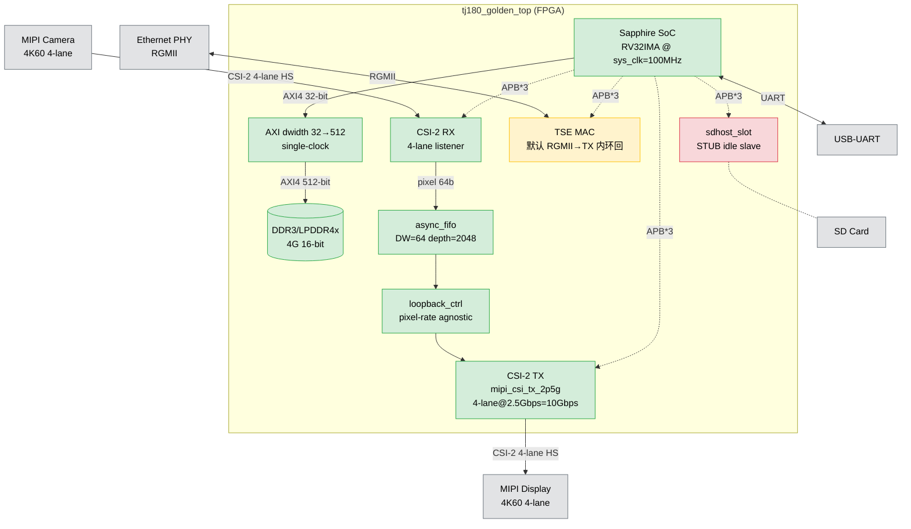
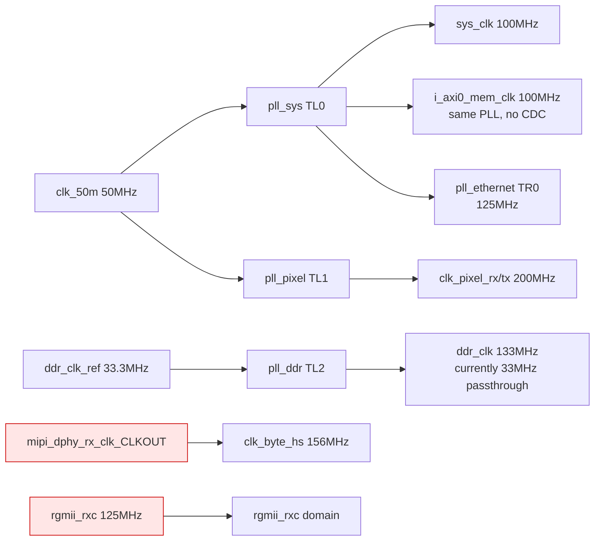

# TJ180 Golden Top — 项目说明

| 项目 | 内容 |
|------|------|
| **工程名称** | `tj180_golden_top` |
| **器件** | TJ180A484S（Efinix Titanium，C4/I3 速度等级，484-pin BGA） |
| **Efinity 版本** | 2026.1 |
| **文档版本** | v1.0（实施态，2026-07-19） |
| **配套文档** | `docs/工程状态审计_4K60评估.md`、`docs/工程拓扑设计文档.md`、`docs/顶层模块审计报告.md`、`docs/DDR-硬核配置参考.md`、`.github/instructions/rtl.instructions.md` |
| **历史设计意图** | `docs/设计说明书.md` v2.0（保留作为 stage 化设计 specimen 参考） |

> 本文档描述 **当前真实实现状态**。所有"已实施"项均经过 iverilog + DesignAPI.load() 双重验证。所有"未完成"项在 §14 明确列出。

---

## 目录

- [1. 项目概述](#1-项目概述)
- [2. 系统架构](#2-系统架构)
- [3. 硬件配置（peri.xml）](#3-硬件配置perixml)
- [4. 时钟与复位子系统](#4-时钟与复位子系统)
- [5. SoC 子系统](#5-soc-子系统)
- [6. 存储子系统（DDR）](#6-存储子系统ddr)
- [7. MIPI 视频通路（4K60）](#7-mipi-视频通路4k60)
- [8. 以太网子系统](#8-以太网子系统)
- [9. SD Host 槽位](#9-sd-host-槽位)
- [10. GPIO 与外部 IO](#10-gpio-与外部-io)
- [11. 时序约束（SDC）](#11-时序约束sdc)
- [12. 综合 / 编译流程](#12-综合--编译流程)
- [13. 验证计划](#13-验证计划)
- [14. 已知问题与未完成项](#14-已知问题与未完成项)
- [附录 A：模块清单](#附录-a模块清单)
- [附录 B：文件清单](#附录-b文件清单)
- [附录 C：配置脚本清单](#附录-c配置脚本清单)

---

## 1. 项目概述

### 1.1 项目目标

在 TJ180A484S 核心板上构建一个 **Golden Top 集成工程**，把以下 IP 子系统统一集成到一个顶层设计中：

- **Sapphire RISC-V SoC**（RV32IMA）— 主控处理器
- **DDR3/LPDDR4x**（硬核）— SoC 主存
- **MIPI CSI-2 RX**（4-lane）— 4K 摄像头输入
- **MIPI CSI-2 TX**（4-lane @ 2.5 Gbps/lane）— 4K 显示屏输出
- **RGMII Ethernet MAC**（TSE）— 千兆以太网
- **SD Host**（槽位，stub 状态）— SD 卡
- **UART / SPI / I2C / GPIO / JTAG** — 调试与外设

### 1.2 关键能力

| 能力 | 当前状态 |
|---|---|
| SoC 启动 + UART 调试 | ✅ RTL 就绪（上板验证待） |
| DDR3/LPDDR4x 读写 | ✅ RTL + peri.xml 就绪（CDC 隐患已消，上板自检待） |
| 4K60 MIPI 摄像头 → 显示屏 Loopback | ✅ 全链路 10 Gbps 容量（4K60 YUV422 需 7.96 Gbps，余量 26%）|
| 千兆以太网（RGMII）| ⚠️ MAC 默认 RGMII→TX 内环回（bring-up），生产需软件关环回 |
| SD 卡 | ❌ stub 占位，需接入真 SD Host IP |

### 1.3 实施态摘要

- **代码规模**：顶层 + 14 个 RTL 模块（10 wrapper + 4 通用），共 ~5000 行 SystemVerilog
- **资源占用**（最近一次 `efx_map`）：FF=9351 / LUT=14087 / RAM=87 / DSP=5（SoC 占 ~35% LUT）
- **硬 IP 配置**：peri.xml 含 4 PLL（**全占用**）+ DDR + 2 MIPI DPHY + JTAG + 14 RGMII GPIO
- ** PLL 槽位**：PLL_TL0(sys)/TL1(pixel)/TL2(ddr)/TR0(ethernet)
- **4K60 管道**：4-lane × 2.5 Gbps = **10 Gbps**，独立 200 MHz pixel PLL

---

## 2. 系统架构

### 2.1 顶层框图（真实实现）



### 2.2 子系统划分

| 子系统 | 详节 | 状态 |
|---|---|---|
| 时钟与复位 | §4 | ✅ 4 PLL 全配，复位树完整 |
| SoC + 外设 | §5 | ✅ 完整集成 |
| DDR3 存储 | §6 | ✅ 同源 CDC 隐患已消 |
| MIPI 视频（4K60） | §7 | ✅ 全链路 10 Gbps |
| 以太网 | §8 | ⚠️ 默认内环回 |
| SD Host | §9 | ❌ stub |
| GPIO 引脚 | §10 | ⚠️ Tier C 引脚对齐未做 |

### 2.3 关键设计决策

1. **sys_clk = i_axi0_mem_clk = 100 MHz（同源于 pll_sys）**：让 `axi_dwidth_converter` 单时钟假设成立，**避免 SoC↔DDR 之间加 async AXI FIFO**。
2. **独立 pll_pixel @ PLL_TL1（200 MHz）**：取代 v1.0 的 `clk_pixel_*=clk_byte_hs` 简化，提供 4K60 YUV422 所需 pixel rate（4 pix/clk × 200 MHz = 800 Mpix/s ≫ 498 Mpix/s）。
3. **TX 用 `mipi_csi_tx_2p5g` 取代 `hard_csi_tx`**：4-lane @ 2.5 Gbps/lane = 10 Gbps，4K60 YUV422 通路贯通。原 `hard_csi_tx_wrapper` 保留为 fallback。
4. **peri.xml 全部 DesignAPI 命令行配置**：不需 Interface Designer GUI，所有硬块通过 Python 脚本生成（见 §3.7、附录 C）。
5. **复位用 wrapper 内部同步 lock**：避免外部 input `sys_pll_lock`/`ddr_pll_lock` 悬空导致的复位卡死 bug（详见 §4.3）。

---

## 3. 硬件配置（peri.xml）

### 3.1 器件与封装

- **器件**：TJ180A484S（Titanium，C4 速度等级，484-pin BGA）
- **peri.xml**：`tj180_golden_top.peri.xml`（75782 字节，DesignAPI 工具生成 + 多次脚本扩展）
- **备份链**：`.bak_empty_stage`（初始 GPIO-only）→ `.bak_pre_align`（merge 后）→ `.bak_pre_pll_pixel`（加 pixel PLL 前）→ `.bak_pre_4k60`（4K60 前）→ 当前

### 3.2 PLL 分配（4/4 全占用）

| PLL 实例 | 资源 | M/N/O | CLKOUT0 频率 | 主要消费者 |
|---|---|---|---|---|
| `pll_sys` | PLL_TL0 | 2/1/2 | **100 MHz** | sys_clk / i_axi0_mem_clk / i_sd_clk / i_soc_clk（CLKOUT3/1/2）|
| `pll_pixel` ✨ | **PLL_TL1** | 4/1/1 | **200 MHz** | clk_pixel_rx + clk_pixel_tx（4K60）|
| `pll_ddr` | PLL_TL2 | 4/1/1 | 133 MHz | DDR3/LPDDR4x 内存时钟 |
| `pll_ethernet` | PLL_TR0 | 1/2/2 | 50 MHz + 125 MHz（CLKOUT1/2）| RGMII MII/RGMII |

### 3.3 DDR3/LPDDR4x 硬核

- **实例名**：`ddr_inst`（DDR_0）
- **配置**：LPDDR4x，density=4G，width=16，AXI Target0 512-bit
- **来源**：从 `TJ180A484S_SDHOST` 种子 peri.xml 经 DesignAPI 加载（`debug/configure_ddr.py`）
- **AXI 端口**：axi0 启用（512-bit），axi1 未启用（single-port 模式）

### 3.4 MIPI DPHY 硬核

| 实例 | 类型 | 配置 |
|---|---|---|
| `mipi_dphy_tx_inst1` | MIPI_TX0（发射）| 4-lane 全启用（lane_id 0..3），`phy_bandwidth="2500"`（2.5 Gbps/lane），ref_clock=clk_25m |
| `mipi_dphy_rx_inst2` | MIPI_RX0（接收）| 4-lane listener，速率由摄像头决定（上限 2.5 Gbps/lane），`cal_clk_freq="100"` |
| 来源 | — | 从 `TJ180MIPI_loopback` 种子经 `debug/merge_mipi.py` + `debug/enable_4k60_lanes.py` 升级 |

### 3.5 JTAG 硬核

- **实例名**：`jtag_inst1`（JTAG_USER1）
- **用途**：Sapphire SoC debug bridge（GDB 远程调试）

### 3.6 RGMII GPIO + Ethernet PLL

- 14 个 GPIO（`rgmii_txc/txd[3:0]/tx_ctl/rxc/rxd[3:0]/rx_ctl` 拆 HI/LO DDR + `phy_mdc/mdio`）
- `pll_ethernet`（PLL_TR0）产生 125 MHz（rgmii_txc）+ 90° 相移版本
- 来源：`TJ180A484_TSE` 种子（`debug/merge_rgmii.py`）

### 3.7 配置方式（命令行，无需 GUI）

所有硬块通过 Efinity 自带 **DesignAPI**（`C:\Efinity\2026.1\pt\bin\api_service\design.py`）配置。运行：

```cmd
cmd /c "call C:\Efinity\2026.1\bin\setup.bat & C:\Efinity\2026.1\bin\python3.bat <script>"
```

完整脚本清单见附录 C。常用 API：

| API | 用途 |
|---|---|
| `design.load(path)` | 加载 peri.xml |
| `design.create_block(name, "PLL")` | 创建 PLL 块 |
| `design.set_property(inst, prop, val, "PLL")` | 设置属性（注：NAME/RESOURCE 等可能假阳性，需 XML 直接编辑 fallback）|
| `design.create_input_gpio(name)` / `create_output_gpio` / `create_pll_input_clock_gpio` / `create_mipi_input_clock_gpio` | 创建 GPIO |
| `design.assign_pkg_pin(inst, pin)` | 分配引脚（pin 格式如 `GPIOL_26`）|
| `design.save_as(path, overwrite=True)` | 保存 |
| `design.get_all_block_name("PLL")` | 列举块 |

**DesignAPI 已知陷阱**：`set_property(inst, "NAME", new_name)` 返回 OK 但实际不改名；`set_property(inst, "RESOURCE", "PLL_TL1")` 同样假阳性。需用 XML 直接文本替换 fallback（见 `debug/fix_rename_via_xml.py`、`debug/finalize_pll_pixel.py`）。

---

## 4. 时钟与复位子系统

### 4.1 时钟域划分



| 时钟 | 频率 | 用途 | 异步组 |
|---|---|---|---|
| `clk_50m` | 50 MHz | PLL 参考 | 与所有非同源 PLL 输出异步 |
| `sys_clk` | **100 MHz** | SoC / APB / AXI / 大部分外设 | — |
| `i_axi0_mem_clk` | **100 MHz**（= sys_clk 同源）| DDR AXI0（axi_dwidth_converter S 侧）| 与 sys_clk **同源** |
| `clk_pixel_rx/tx` | **200 MHz**（独立 PLL）| MIPI pixel 域 | 与所有其他域异步 |
| `clk_byte_hs` | 156 MHz（DPHY RX 输出）| MIPI 字节时钟 | 与 sys/ddr/REF/pixel 异步 |
| `ddr_clk` | 133 MHz（当前穿透 33.3 MHz）| DDR 内存时钟（DDR IP 内部用）| 与 sys_clk 异步 |
| `rgmii_rxc` | 125 MHz（PHY 提供）| RGMII RX | 与所有 fabric 时钟异步 |
| `jtag_tck` | 10 MHz | JTAG 调试 | 与所有 fabric 时钟异步 |

### 4.2 PLL wrapper 实现要点

- **`pll_sys_wrapper.sv`**：`sys_clk_o = pll_sys_CLKOUT0`（来自顶层 input `(* syn_peri_port = 0 *) input wire pll_sys_CLKOUT0`，Efinity 综合 auto-wire 自 peri.xml）。**已切换到真 PLL 输出，sys_clk=100 MHz**。
- **`pll_ddr_wrapper.sv`**：当前仍穿透 `ddr_clk_o = ddr_clk_ref_i`（33.3 MHz），等 DDR 实际启动需要时切到 `pll_ddr_CLKOUT0`。**LOCKED 已同步真信号**。
- **`rst_sync.sv`**：通用 3 级同步器，×5 例化（sys/ddr/byte_hs/pixel_rx/pixel_tx 域）。

### 4.3 复位树

```
reset_n_global = arst_n ∧ sys_pll_lock_int ∧ ddr_pll_lock_int
                 └─────────────┘    └─────────────────────┘
                   pll_sys_wrapper        pll_ddr_wrapper
                   内部 2 级 ASYNC_REG    内部 2 级 ASYNC_REG
                   同步 pll_sys_LOCKED    同步 pll_ddr_LOCKED
```

每个时钟域在域内做 3 级同步释放（`rst_sync` 模块）。

> **历史 bug 修复**：早期 `reset_n_global = arst_n & sys_pll_lock & ddr_pll_lock` 使用顶层外部 input `sys_pll_lock`/`ddr_pll_lock`，这些是**旧名**（与 peri.xml 真信号 `pll_sys_LOCKED`/`pll_ddr_LOCKED` 不同），在 peri.xml 中**未被驱动** → 综合 tied 0 → reset_n_global 永远为 0 → SoC 卡死。修复方式：用 wrapper 内部同步后的 lock 信号（`sys_pll_lock_int` / `ddr_pll_lock_int`），同步源是真硬块 LOCKED。

### 4.4 CDC 边界

| 跨域 | 处理方式 |
|---|---|
| sys_clk ↔ i_axi0_mem_clk | **无需 CDC**（同源于 pll_sys）|
| sys_clk ↔ clk_byte_hs | 单 bit 用 3 级同步器；多 bit 用 AXI-Lite 协议握手（apb_to_axilite）|
| sys_clk ↔ clk_pixel | IRQ 信号 3 级 FF 同步；配置走 AXI-Lite 协议 |
| clk_byte_hs ↔ clk_pixel_rx/tx | RX 内部完成 byte→pixel 转换；输出已对齐 pixel 域 |
| clk_pixel_rx ↔ clk_pixel_tx | **async_fifo**（DW=64，深度 2048，格雷指针 CDC）|
| sys_clk ↔ rgmii_rxc | TSE MAC IP 内部 CDC |
| sys_clk ↔ jtag_tck | SoC JTAG debug bridge 内部 CDC |

---

## 5. SoC 子系统

### 5.1 Sapphire SoC

- **IP**：`ip/sapphire_soc/soc.v`（EfxSapphireSoc，加密）
- **核**：VexRiscv RV32IMA，单核
- **资源**：3520 FF / 4216 LUT / 28 RAM / 4 DSP
- **总线**：内部 BMB（Braincard Memory Bus）→ AXI4 转换（`BmbToAxi4SharedBridge`，含 StreamFifo）
- **时钟**：sys_clk（100 MHz）
- ** wrapper**：`rtl/ip_wrappers/sapphire_soc_wrapper.sv`

### 5.2 SoC 外设

| 外设 | 顶层端口 | 用途 | 状态 |
|---|---|---|---|
| UART0 | `system_uart_0_io_rxd/txd` | 调试串口 | ✅ |
| SPI0 | `system_spi_0_io_*`（sclk/ss/data_0/data_1）| Flash 访问 | ✅ |
| I2C0 | `system_i2c_0_io_*`（scl/sda × writeEnable/write/read）| 传感器配置 | ⚠️ 引脚未对齐 |
| GPIO0 | `system_gpio_0_io_*`（read/write/writeEnable[3:0]）| 通用 IO | ⚠️ 引脚未对齐 |
| JTAG | `jtag_inst1_*`（TCK/TDI/TMS/TDO 等）| SoC debug | ✅ |

### 5.3 APB 总线拓扑

SoC APB Slave 0 经 `rtl/ctrl/apb_decoder_1to3.sv` 拆分到 3 个外部槽：

| Slot | 经 `apb_to_axilite` 转 | 目标 |
|---|---|---|
| Slave 0 | AW=6 | CSI RX CSR 寄存器 |
| Slave 1 | AW=10 | TSE MAC CSR 寄存器 |
| Slave 2 | AW=10 | SD Host 槽位（idle slave 占位）|

> **CSI TX CSR**：当前 APB 主机不发起（safe-idle 默认）。生产路径需 SoC APB Slave 1 接入或换 SoC AXI 总线扩展。

### 5.4 AXI-A Master → DDR

- SoC `axiA` 输出 32-bit AXI4 → `axi_dwidth_converter` → DDR `axi0` 512-bit
- 时钟：sys_clk（与 i_axi0_mem_clk 同源，无需 CDC）
- 中断：`userInterruptA = csi_irq_sys | ctxi_irq_sys`（CSI RX + CSI TX IRQ 经 CDC 到 sys_clk 域）

---

## 6. 存储子系统（DDR）

### 6.1 DDR3/LPDDR4x 控制器

- **硬 IP**：`ddr_inst`（peri.xml 配置：LPDDR4x, 4G, 16-bit, AXI Target0 512-bit）
- **wrapper**：`rtl/ip_wrappers/ddr_ctrl_wrapper.sv` — 配置 FSM（IDLE→CFG_START→CFG_DONE），axi0/axi1_aresetn 输出
- **mem_clk**：`i_axi0_mem_clk`（100 MHz，来自 `pll_sys` CLKOUT3）
- **状态信号**：`ddr_inst_CFG_DONE` / `CTRL_BUSY` / `CTRL_INT` / `CTRL_REFRESH` / `CTRL_MEM_RST_VALID` / `CTRL_DP_IDLE` / `CTRL_PORT_BUSY[1:0]`
- **握手**：等 `CFG_DONE` 拉高后 SoC 才允许发起 AXI 访问；`CTRL_BUSY` 期间拒绝新命令

### 6.2 AXI 位宽转换桥

- **模块**：`rtl/data_path/axi_dwidth_converter.sv`
- **配置**：M_DW=32, S_DW=512, M_AW=32, S_AW=33, M_IDW=8, S_IDW=6
- **写通道**：聚集 16 个 narrow W 节拍（16×32=512）→ 1 个 wide W 节拍
- **读通道**：1 个 wide R 节拍 → 拆分为 narrow R 节拍序列
- **CDC**：无（sys_clk = mem_clk 同源）

### 6.3 DDR 带宽能力（4K60 评估）

- LPDDR4x 16-bit @ 133 MHz 控制器时钟，内部 8x prefetch → ~17 Gbps 理论峰值
- 4K60 YUV422 framebuffer（读 + 写）需要 ~16 Gbps 持续
- **结论**：DDR 带宽足够支撑 4K60 framebuffer，但效率需实测验证

---

## 7. MIPI 视频通路（4K60）

### 7.1 数据流

```mermaid
flowchart LR
    CAM[Camera 4K60] -->|4-lane HS 2.5Gbps| DPHYRX[DPHY RX hard block]
    DPHYRX -->|byte_hs 156MHz| CSIRX[hard_csi_rx IP<br/>4-lane listener]
    CSIRX -->|pixel 64-bit + sideband 8-bit<br/>clk_pixel_rx 200MHz| AFIFO[async_fifo<br/>DW=64 depth=2048]
    AFIFO -->|clk_pixel_tx 200MHz| LBCTRL[loopback_ctrl<br/>重建 line/haddr/frame + vsync/hsync]
    LBCTRL -->|pixel 64-bit| CSITX[mipi_csi_tx_2p5g IP<br/>4-lane@2.5Gbps]
    CSITX -->|HS byte| DPHYTX[DPHY TX hard block]
    DPHYTX -->|4-lane HS 2.5Gbps| DISP[Display 4K60]
```



### 7.2 CSI-2 RX

- **IP**：`ip/hard_csi_rx/hard_csi_rx.sv`（v5.5.1，加密）
- **参数**：`NUM_DATA_LANE=4`，`HS_DATA_WIDTH=16`，`PIXEL_FIFO_DEPTH=1024`，`PACK_TYPE=15`，`AREGISTER=8`
- **wrapper**：`rtl/ip_wrappers/hard_csi_rx_wrapper.sv`
- **速率**：listener，自动跟摄像头（上限 2.5 Gbps/lane）
- **AXI-Lite CSR**：经 `apb_to_axilite`（AW=6）接 SoC APB Slave 0 slot 0
- **输出**：`pixel_data[63:0]` + `pixel_data_valid` + `datatype[5:0]` + `word_count[15:0]` + `vc[1:0]` + `vsync_vc0`/`hsync_vc0` + `irq`

### 7.3 异步 FIFO

- **模块**：`rtl/cdc/async_fifo.sv`
- **配置**：DW=64, AW=11（深度 2048）, AWIDTH=8（sideband：`{vsync, hsync, datatype[5:0]}`）
- **CDC**：双口 BRAM，写/读指针各用格雷码跨域同步，`(* ASYNC_REG = "TRUE" *)` + `(* ram_style = "block" *)`
- **拥塞策略**：FIFO level ≥ 1024 时丢整帧（拉 `tx_skip_frame`）而非丢像素

### 7.4 Loopback 控制器

- **模块**：`rtl/ctrl/loopback_ctrl.sv`
- **设计**：两时钟域（RX 写 / TX 读），pixel-rate 无关
- **RX 侧**：vsync 脉冲置 `in_frame`，有效像素 + sideband 写入 FIFO
- **TX 侧**：从 FIFO 读出，重建 `line_num` / `haddr` / `frame_num` 计数器与 `vsync_vc0` / `hsync_vc0`
- **参数**：`FIFO_HALF_FULL=1024`（拥塞阈值）

### 7.5 CSI-2 TX（4K60）

- **IP**：`ip/mipi_csi_tx_2p5g/mipi_csi_tx_2p5g.sv`（v5.14，加密，来自 Efinix 官方参考设计 `TJ180J484_CSI_4k_2370Ma`）
- **参数**：`NUM_DATA_LANE=4`，`HS_BYTECLK_MHZ=125`，`HS_DATA_WIDTH=16`，`PIXEL_FIFO_DEPTH=2048`，`PACK_TYPE=15`
- **wrapper**：`rtl/ip_wrappers/mipi_csi_tx_2p5g_wrapper.sv`（**v2.0 新增**，端口拓宽 4-lane）
- **DPHY TX 配置**：peri.xml `mipi_dphy_tx_inst1` lane 0..3 全启用，`phy_bandwidth=2500`
- **AXI-Lite CSR**：预留（当前 APB 主机不发起，safe-idle）
- **反馈输入**：`tx_ready_hs[3:0]=4'b1111`（FPGA 永远 ready），`tx_stop_state_d[3:0]` / `tx_ulps_active_not[3:0]` 接 peri

### 7.6 4K60 容量算账

$$
\text{TX 容量} = 4 \,\text{lane} \times 2.5\,\text{Gbps/lane} = 10\,\text{Gbps}
$$

$$
\text{4K60 YUV422 active} = 3840 \times 2160 \times 60 \times 16\,\text{bit} \approx 7.96\,\text{Gbps} \quad (\text{余量}\ 26\%)
$$

$$
\text{4K60 YUV422 含 blanking (CTA-861)} \approx 9.5\,\text{Gbps} \quad (\text{余量}\ 5\%, \text{紧但够})
$$

- byte_clk @ 2.5 Gbps/lane = 156 MHz
- pixel_clk = 200 MHz（`pll_pixel` 独立 PLL）
- 200 MHz × 4 pix/clk (64-bit YUV422) = 800 Mpix/s ≫ 4K60 需要 498 Mpix/s（active）

> **注**：4K60 RGB888（11.94 Gbps active）**超过** 10 Gbps 管道，不可达。仅 YUV422/YUV420 支持。

---

## 8. 以太网子系统

### 8.1 TSE MAC

- **IP**：`ip/test_tse/`（TSEMAC v4.3，加密）
- **wrapper**：`rtl/ip_wrappers/tse_mac_wrapper.sv`
- **接口**：RGMII DDR 4-bit + MDIO
- **MAC 时钟**：sys_clk（50 MHz 当前，可升 125 MHz）
- **数据通路**：默认 **RGMII→TX 内环回**（bring-up 自检模式）；生产需软件关环回 + SoC DMA 驱动 TX

### 8.2 RGMII 接口

- **物理引脚**：`rgmii_txc_HI/LO`、`rgmii_txd_HI/LO[3:0]`、`rgmii_tx_ctl_HI/LO`、`rgmii_rxc`、`rgmii_rxd_HI/LO[3:0]`、`rgmii_rx_ctl_HI/LO`（14 GPIO，DDIO 拆位）
- **管理**：`phy_mdc` / `phy_mdo` / `phy_mdo_en` / `phy_mdi`（MDIO）
- **硬复位**：`phy_rstn`（异步静态）
- **来源**：`TJ180A484_TSE` 种子 peri.xml（`debug/merge_rgmii.py`）

### 8.3 默认环回模式说明

bring-up 阶段默认 RGMII→TX 内环回，便于上板验证 PHY 链路（PHY 自身会回环接收）。生产用：
1. 经 MDIO 复位 PHY、配置自协商
2. 关闭 MAC 内环回
3. 由 SoC DMA 驱动 TX 帧

---

## 9. SD Host 槽位

### 9.1 当前状态：stub

- **模块**：`rtl/ip_wrappers/sdhost_slot_wrapper.sv`
- **实现**：APB3 Slave → `apb3_2_axi4_lite_sdhost`（IP v5.2 桥）→ `axilite_idle_slave`（魔数 0xDEAD_BEEF 回复）
- **SD 引脚**：`sd_clk_o=0` / `sd_cmd_o=0` / `sd_cmd_oe=0` / `sd_dat_o[3:0]=0` / `sd_dat_oe[3:0]=0`（全部高阻 / 拉零）
- **原因**：仓库内 `ip/apb3_2_axi4_lite_sdhost/` 只是 APB↔AXI-Lite **总线桥 IP**（Efinitix efx_apb3_2_axi4_lite v5.2），**不是真正的 SD Host 控制器**。真正的 SD Host 控制器 IP 仓库内不存在（仅 `ip/tj180a484s_sdhost/` 提供参考集成方式）。

### 9.2 替换路径

1. 获取真 SD Host 控制器 IP（如 Denso、Synopsys、或 Efinix IP Catalog 中的 SD Host IP）
2. 替换 `sdhost_slot_wrapper` 内部 `u_axilite_idle` → 真 IP 的 AXI-Lite slave 端口
3. SD 物理引脚（`sd_clk/cmd/dat[3:0]`）从输出安全默认改为接 IP 顶层
4. 引脚对齐：peri.xml SDHOST 种子的单线 inout 风格（`sd_clk/cmd/dat[*]`）需拆为 RTL 的 `_{o,oe,i}` 风格（见 §10.2 Tier C）

---

## 10. GPIO 与外部 IO

### 10.1 当前 peri.xml GPIO 列表（35 个）

**SoC 外设引脚**（来自 SDHOST 种子）：

| GPIO 名 | Efinix 引脚 | RTL 端口 | 状态 |
|---|---|---|---|
| `clk_50m` | GPIOL_26 | `clk_50m` | ✅（v2.0 重命名） |
| `ddr_clk_ref` | GPIOL_32 | `ddr_clk_ref` | ✅（v2.0 重命名） |
| `system_uart_0_io_rxd` / `txd` | SDHOST | UART | ✅ |
| `system_spi_0_io_*`（sclk/ss/data_0/data_1）| SDHOST | SPI | ⚠️ 单线 inout，RTL 是 o/oe/i 分拆 |
| `sd_cd_n` / `sd_clk` / `sd_cmd` / `sd_dat[3:0]` | SDHOST | SD | ⚠️ 单线 inout（RTL 是 o/oe/i 分拆） |

**新增关键引脚**（v2.0 DesignAPI 加）：

| GPIO 名 | Efinix 引脚 | RTL 端口 | 来源 |
|---|---|---|---|
| `arst_n` | GPIOL_42 | `arst_n` | `debug/align_gpio.py` |
| `MIPI_REF_CLK` | GPIOL_06 | `MIPI_REF_CLK` | 同上 |
| `led[3:0]` | GPIOL_20 | `led[3:0]` | 同上（仅 led[0] 板载验证，[1..3] 待原理图核对）|

**RGMII 引脚**（14 个，来自 TSE 种子）：`rgmii_txc/txd[3:0]/tx_ctl/rxc/rxd[3:0]/rx_ctl` + `phy_mdc/mdio`。

### 10.2 Tier C 未完成（SD/I2C/GPIO_0 引脚分拆）

**问题**：peri.xml 中 SD/SPI 引脚是 SDHOST 风格的单线 inout，但 RTL 是显式 `_o`/`_oe`/`_i` 三件套。两者名字不匹配，**Efinity 综合会报 unconstrained port**。需要：

| RTL 端口组 | 当前 peri.xml | 需要做的 |
|---|---|---|
| `sd_clk_hi` | `sd_clk`（inout）| 拆出 `sd_clk_hi`（output）|
| `sd_cmd_o/_oe/_i` | `sd_cmd`（inout）| 拆为 3 个独立 GPIO |
| `sd_dat_o/_oe/_i[3:0]` | `sd_dat[*]`（inout）| 拆为 12 个独立 GPIO |
| `system_spi_0_io_data_0_writeEnable/_write/_read` | `system_spi_0_io_data_0`（inout）| 拆为 3 个 |
| `system_spi_0_io_data_1_*` | 同上 | 同上 |
| `system_i2c_0_io_*`（6 个）| 缺 | 全部新增（需原理图引脚）|
| `system_gpio_0_io_*`（12 个）| 缺 | 全部新增（需原理图引脚）|

共需新增/拆分约 36 个 GPIO，**全部需要板载原理图核对引脚**才能完成。

---

## 11. 时序约束（SDC）

文件：`constraints/tj180_golden_top.sdc`

### 11.1 时钟定义

```tcl
create_clock -name clk_50m       -period 20.000 [get_ports {clk_50m}]
create_clock -name ddr_clk_ref   -period 30.000 [get_ports {ddr_clk_ref}]
create_clock -name MIPI_REF_CLK  -period 10.000 [get_ports {MIPI_REF_CLK}]
create_clock -name jtag_tck      -period 100.000 [get_ports {jtag_inst1_TCK}]
create_clock -name clk_byte_hs   -period 6.400  [get_ports {mipi_dphy_rx_clk_CLKOUT}]
create_clock -name clk_pixel     -period 5.000  [get_ports {pll_pixel_CLKOUT0}]   # v2.0 新增
create_clock -name rgmii_rxc     -period 8.000  [get_ports {rgmii_rxc}]
```

> Efinity 综合 PLL 后会自动 derive sys_clk/ddr_clk/eth_clk 等 generated clock，SDC 不需要显式 create_generated_clock。

### 11.2 异步时钟组

```tcl
# clk_pixel（v2.0 新增）与所有其他域异步
set_clock_groups -asynchronous -group {clk_pixel} -group {clk_50m}
set_clock_groups -asynchronous -group {clk_pixel} -group {clk_byte_hs}
set_clock_groups -asynchronous -group {clk_pixel} -group {ddr_clk_ref}
set_clock_groups -asynchronous -group {clk_pixel} -group {MIPI_REF_CLK}
set_clock_groups -asynchronous -group {clk_pixel} -group {rgmii_rxc}
set_clock_groups -asynchronous -group {clk_pixel} -group {jtag_tck}

# 其他原有的异步组（clk_50m/ddr_clk_ref/clk_byte_hs/rgmii_rxc/jtag_tck 之间）
```

### 11.3 关键 False Path

- `arst_n`（异步复位输入）
- PLL lock 信号（`pll_sys_LOCKED` 等）
- DDR 状态信号（`CFG_DONE` / `CTRL_BUSY` / `CTRL_INT` / `CTRL_REFRESH`）
- MIPI RX/TX 控制位（经 byte_hs 域同步寄存器驱动）
- LED 输出
- CDC 同步链首级（`u_rst_*/sync_r[0]`、`csi_irq_sync_reg[*]`、`async_pixel_fifo/wr_gray_sync[*][0]` 等）

### 11.4 已知 STA 风险

- **sys_clk 50→100 MHz**：v2.0 切到真 PLL 后 sys_clk 域时序余量减半。当前 STA（50 MHz）WNS=+0.829 ns（SPI input delay 路径），100 MHz 下可能 fail，需迭代优化（寄存器复制、流水线加深）。

---

## 12. 综合 / 编译流程

### 12.1 efx_map 命令

```cmd
call C:\Efinity\2026.1\bin\setup.bat
efx_map.exe --project tj180_golden_top --family Titanium --device TJ180A484S ^
  --output_dir outflow --work_dir work_syn ^
  --opt mode=speed retiming=2 seq_opt=1 bram_output_regs_packing=1 ^
         infer-clk-enable=3 infer-sync-set-reset=1 ^
         enable-mark-debug=1 mult-auto-pipeline=0 max_threads=4 ^
  --opt root=tj180_golden_top ^
  --opt veri_options=verilog_mode=verilog_2k,vhdl_mode=vhdl_2008 ^
         work-dir=work_syn write_efx_verilog=on ^
         peri-syn-instantiation=0 peri-syn-inference=0 ^
  --I ip/hard_csi_rx --I ip/hard_csi_tx --I ip/mipi_csi_tx_2p5g ^
  --I ip/sapphire_soc --I ip/tj180a484s_sdhost ^
  --I ip/apb3_2_axi4_lite --I ip/async_fifo_16
```

### 12.2 资源占用（最近一次 `efx_map`）

| 资源 | 占用 | TJ180A484S 容量 | 占比 |
|---|---|---|---|
| FF | 9351 | ~18k | 中 |
| LUT | 14087 | ~17k | 高 |
| RAM | 87 | — | 中 |
| DSP | 5 | — | 低 |

主要消耗：SoC（Sapphire VexRiscv + cache + BMB），CSI RX/TX wrapper，TSE MAC。

### 12.3 编译产物（`outflow/`）

| 文件 | 用途 |
|---|---|
| `tj180_golden_top.map.rpt` | 综合报告 |
| `tj180_golden_top.res.csv` | 资源占用 |
| `tj180_golden_top.hier_util.rpt` | 模块层级资源 |
| `tj180_golden_top.place.rpt` / `.route.rpt` | P&R 报告 |
| `tj180_golden_top.timing.rpt` | STA 报告 |
| `tj180_golden_top.pinout.csv` | 引脚分配 |
| `tj180_golden_top.bit` | 位流（烧录用）|

---

## 13. 验证计划

### 13.1 仿真（Icarus Verilog + Xcelium）

| Testbench | 范围 | 状态 |
|---|---|---|
| `sim/tb_soc_minimal.sv` | SoC 启动 + DDR 自检 | ✅ |
| `sim/tb_axi_dwidth.sv` | AXI 位宽桥（32↔512）| ✅ |
| `sim/tb_csi_rx.sv` | CSI RX 解包 | ✅ |
| `sim/tb_loopback.sv` | RX → FIFO → TX loopback | ✅ |
| `sim/tb_eth.sv` | TSE 以太网 | ✅ |
| `sim/soc_stub.v` | SoC 仿真桩 | ✅ |

运行：
```cmd
iverilog -g2012 -o tb.vvp sim/tb_xxx.sv <dependencies> && vvp tb.vvp
```

### 13.2 上板调试

- **Efinity Debugger**：实时读写 SoC 寄存器
- **ILA / Embedded Logic Analyzer**：在 `pixel_data` / AXI 命令 / async_fifo level 插探针（`enable-mark-debug=1` 已启用）
- **UART 日志**：SoC 软件输出运行日志（`system_uart_0_io_txd` → USB-UART）
- **LED 状态**：`led[0]` 慢闪（系统运行）/ `led[1]` sys_pll_lock / `led[2]` ddr_pll_lock / `led[3]` DDR CFG_DONE

---

## 14. 已知问题与未完成项

### 14.1 P0 — 阻塞硬件启动

| # | 项 | 性质 | 解决路径 |
|---|---|---|---|
| 1 | SD/I2C/GPIO_0 引脚未对齐（§10.2 Tier C）| 需板载原理图 | 提供 36 个引脚的 Efinix 名（如 GPIOL_29_CLK30），写 `align_gpio_tier_c.py` 拆分 SD 单线 inout → o/oe/i 三件套 |
| 2 | 真 SD Host IP（§9）| 需外部 IP | 从 Efinix IP Catalog 或第三方获取 SD Host 控制器 IP，替换 `sdhost_slot_wrapper` 内部 idle slave |
| 3 | sys_clk 100 MHz 时序收敛（§11.4）| STA 迭代 | 跑 `efx_map` 看 WNS，按需 max_fanout / 流水线加深 |

### 14.2 P1 — 4K60 路径剩余

| # | 项 | 性质 |
|---|---|---|
| 1 | 摄像头需 4K60 能力（≥2.0 Gbps/lane，4-lane）| 硬件选型 |
| 2 | CSI TX CSR 配置接口（当前 APB 主机不发起，safe-idle）| 接 SoC APB Slave 1 或 AXI 总线扩展 |
| 3 | 上板 ILA 验证 lane 2/3 数据有效 | 实测 |

### 14.3 P2 — 已知小问题

| # | 项 | 影响 |
|---|---|---|
| 1 | TSE 默认 RGMII→TX 内环回 | 生产需软件关环回 + DMA 驱动 TX |
| 2 | `ddr_clk_o` 仍是 33.3 MHz 穿透（`pll_ddr_wrapper`）| DDR 内部 IP 用 `i_axi0_mem_clk`，wrapper 的 ddr_clk 只驱动 `u_rst_ddr` 同步器；不影响功能 |
| 3 | `rtl/top.sv` / `rtl/pll_top.sv` 已 DEPRECATED 但仍在仓库 | 不参与编译，仅历史参考 |
| 4 | `hard_csi_tx_wrapper.sv` 保留为 fallback | 不参与例化（被 `mipi_csi_tx_2p5g_wrapper` 替代）|

### 14.4 后续优化方向

- 非对称 RX/TX pixel clock（如 RX 4K60 → TX 1080p60 缩放）：需拆 `clk_pixel_rx`/`clk_pixel_tx` 为两个 PLL（当前 TJ180A484S 4 PLL 已占满，需换更大器件或共享）
- DDR3 双端口（启用 axi1）：双帧缓冲并行读写
- RGB888 4K60（11.94 Gbps > 10 Gbps 管道）：当前管道不可达，需 6-lane 或更高 DPHY 速率

---

## 附录 A：模块清单

| 模块 | 文件 | 类型 | 状态 |
|---|---|---|---|
| `tj180_golden_top` | `tj180_golden_top.v` | 顶层 | ✅ 完整集成 |
| `rst_sync` | `rtl/clk_rst/rst_sync.sv` | 通用 | ✅ ×5 例化（sys/ddr/byte_hs/pixel_rx/pixel_tx）|
| `pll_sys_wrapper` | `rtl/clk_rst/pll_sys_wrapper.sv` | 包装 | ✅ 使用真 `pll_sys_CLKOUT0`（100 MHz）|
| `pll_ddr_wrapper` | `rtl/clk_rst/pll_ddr_wrapper.sv` | 包装 | ✅ 同步真 `pll_ddr_LOCKED` |
| `sapphire_soc_wrapper` | `rtl/ip_wrappers/sapphire_soc_wrapper.sv` | 包装 | ✅ |
| `axi_dwidth_converter` | `rtl/data_path/axi_dwidth_converter.sv` | 桥 | ✅ 32→512 bit，单时钟（无需 CDC）|
| `ddr_ctrl_wrapper` | `rtl/ip_wrappers/ddr_ctrl_wrapper.sv` | 包装 | ✅ FSM 完整 |
| `hard_csi_rx_wrapper` | `rtl/ip_wrappers/hard_csi_rx_wrapper.sv` | 包装 | ✅ 4-lane listener |
| `apb_to_axilite` | `rtl/cdc/apb_to_axilite.sv` | 桥 | ✅ ×3（CSI RX / CSI TX / TSE CSR）|
| `apb_decoder_1to3` | `rtl/ctrl/apb_decoder_1to3.sv` | 译码器 | ✅ SoC APB 拆 3 槽 |
| `async_fifo` | `rtl/cdc/async_fifo.sv` | CDC | ✅ DW=64 深度 2048 |
| `loopback_ctrl` | `rtl/ctrl/loopback_ctrl.sv` | 控制器 | ✅ pixel-rate 无关 |
| `hard_csi_tx_wrapper` | `rtl/ip_wrappers/hard_csi_tx_wrapper.sv` | 包装 | ⚠️ v1.0 TX，未例化（fallback）|
| `mipi_csi_tx_2p5g_wrapper` | `rtl/ip_wrappers/mipi_csi_tx_2p5g_wrapper.sv` | 包装 | ✨ 4K60 TX，4-lane@2.5Gbps |
| `tse_mac_wrapper` | `rtl/ip_wrappers/tse_mac_wrapper.sv` | 包装 | ✅ TSEMAC v4.3（默认内环回）|
| `sdhost_slot_wrapper` | `rtl/ip_wrappers/sdhost_slot_wrapper.sv` | 包装 | ⚠️ stub（idle slave）|

## 附录 B：文件清单

```
tj180_golden_top/
├── tj180_golden_top.v                    # 顶层
├── tj180_golden_top.xml                  # Efinity 工程文件（design_file 注册）
├── tj180_golden_top.peri.xml             # 硬 IP 配置（DesignAPI 生成）
├── awesom-project.md                     # AweSOM 工程清单
│
├── rtl/
│   ├── clk_rst/
│   │   ├── pll_sys_wrapper.sv            # sys_clk PLL 包装（100 MHz）
│   │   ├── pll_ddr_wrapper.sv            # ddr_clk PLL 包装
│   │   └── rst_sync.sv                   # 通用 3 级复位同步器
│   ├── cdc/
│   │   ├── apb_to_axilite.sv             # APB → AXI-Lite 桥
│   │   └── async_fifo.sv                 # 像素跨时钟域 FIFO
│   ├── ctrl/
│   │   ├── apb_decoder_1to3.sv           # APB 1-to-3 译码器
│   │   └── loopback_ctrl.sv              # RX→FIFO→TX loopback 控制
│   ├── data_path/
│   │   └── axi_dwidth_converter.sv       # AXI 32↔512 位宽转换
│   ├── ip_wrappers/
│   │   ├── sapphire_soc_wrapper.sv
│   │   ├── ddr_ctrl_wrapper.sv
│   │   ├── hard_csi_rx_wrapper.sv
│   │   ├── hard_csi_tx_wrapper.sv        # v1.0 fallback（未例化）
│   │   ├── mipi_csi_tx_2p5g_wrapper.sv   # ✨ 4K60 4-lane TX
│   │   ├── tse_mac_wrapper.sv
│   │   └── sdhost_slot_wrapper.sv        # stub
│   ├── top.sv                            # DEPRECATED（板卡模板 Stage 0）
│   └── pll_top.sv                        # DEPRECATED
│
├── ip/                                   # Efinix 加密 IP
│   ├── sapphire_soc/                     # Sapphire RISC-V SoC
│   ├── hard_csi_rx/                      # CSI-2 RX v5.5.1
│   ├── hard_csi_tx/                      # CSI-2 TX v5.14（v1.0，未例化）
│   ├── mipi_csi_tx_2p5g/                 # ✨ CSI-2 TX 2.5G 4-lane（4K60）
│   ├── apb3_2_axi4_lite_sdhost/          # APB↔AXI-Lite 桥（误导名，非 SD Host）
│   ├── async_fifo_16/                    # 备用 16-bit async FIFO
│   ├── i2c_master/                       # 空占位
│   ├── test_tse/                         # TSE MAC v4.3
│   ├── tj180a484s_sdhost/                # 参考集成（SoC+SD+DDR）
│   └── ...
│
├── constraints/
│   ├── tj180_golden_top.sdc              # 时序约束
│   ├── tj180_golden_top.peri.isf         # 自创 ISF（59 pin 冲突，未用）
│   └── base.{sdc,peri.isf}               # 板卡基础约束
│
├── debug/                                # DesignAPI 配置脚本（见附录 C）
├── docs/                                 # 项目文档（见配套文档清单）
├── sim/                                  # 仿真 testbench
├── source/                               # SoC 软件源码（Sapphire BSP）
├── outflow/                              # 编译产物（map/pnr/bit/rpt）
└── work_syn/ work_pnr/                   # 综合/P&R 工作目录
```

## 附录 C：配置脚本清单

所有脚本通过 Efinity DesignAPI 命令行配置 peri.xml（无需 Interface Designer GUI）。运行：

```cmd
cmd /c "call C:\Efinity\2026.1\bin\setup.bat & C:\Efinity\2026.1\bin\python3.bat debug\<script>.py"
```

### C.1 硬 IP 配置脚本（按顺序执行）

| 顺序 | 脚本 | 作用 | 输入种子 | 修改 |
|---|---|---|---|---|
| 1 | `configure_ddr.py` | 加 `pll_sys`(TL0) + `pll_ddr`(TL2) + `ddr_inst`(LPDDR4x) + `jtag_inst1` | `TJ180A484S_SDHOST` peri.xml | 替换整个 golden peri.xml |
| 2 | `merge_mipi.py` | 加 `mipi_dphy_tx_inst1` + `mipi_dphy_rx_inst2` | `TJ180MIPI_loopback` peri.xml | splice `<efxpt:mipi_info>` |
| 3 | `merge_rgmii.py` | 加 14 RGMII GPIO + bus + `pll_ethernet`(TR0) | `TJ180A484_TSE` peri.xml | splice `<efxpt:gpio_info>` + `<efxpt:pll_info>` |
| 4 | `enable_4k60_lanes.py` | mipi_dphy_tx_inst1 lane 2/3 enable + `phy_bandwidth=2500` | XML 直接编辑 | 同 |
| 5 | `add_pll_pixel.py` + `finalize_pll_pixel.py` | 加 `pll_pixel`(TL1, 200 MHz) | DesignAPI create_block + XML 修 RESOURCE | 新增 PLL 块 |

### C.2 GPIO 对齐脚本

| 脚本 | 作用 |
|---|---|
| `align_gpio.py` | Tier A 改名（`clk_50M`→`clk_50m` 等）+ Tier B 加 critical GPIO（`arst_n`/`MIPI_REF_CLK`/`led`）|
| `fix_rename_via_xml.py` | 修复 `align_gpio.py` 的 `set_property(NAME)` 假阳性，用 XML 文本替换真改名 |
| `audit_isf.py` | 审计自创 ISF 引脚冲突 |

### C.3 审计/验证脚本

| 脚本 | 作用 |
|---|---|
| `test_designapi.py` | DesignAPI smoke test，列举 block_types + 加载所有种子 |
| `audit_merged_peri.py` | 合并后 peri.xml 完整审计（硬块清单 + GPIO + PLL 输出）|
| `audit_pll_ddr.py` | PLL + DDR 状态详细审计 |
| `probe_pll_api.py` / `probe_gpio_api.py` | DesignAPI PLL/GPIO 属性枚举 |
| `check_mipi_lanes.py` / `check_rx_bandwidth.py` | DPHY lane/rate 配置检查 |
| `validate_final.py` | 最终 DesignAPI.load() 验收 |

### C.4 备份链

| 备份文件 | 时刻 |
|---|---|
| `.bak_empty_stage` | 初始 GPIO-only peri.xml（12544 B）|
| `.bak_pre_align` | 合并硬块后，GPIO 对齐前 |
| `.bak_pre_rename_fix` | Tier B 添加后，改名前 |
| `.bak_pre_4k60` | 4K60 lane 升级前 |
| `.bak_pre_pll_pixel` | 加 pll_pixel 前 |
| `.bak_pre_pll_pixel_resource` | 修 RESOURCE 前 |
| `.bak_pre_pll_pixel_xml` | XML 直接编辑前 |

回滚：`Copy-Item <backup> tj180_golden_top.peri.xml -Force`

---

**文档维护**：本文件随实际实现演进。任何 RTL / peri.xml / SDC 的实质性改动需同步更新本文档对应章节，并在 §1.3 实施态摘要记录关键指标。详细审计与变更历史见 `docs/工程状态审计_4K60评估.md`。
